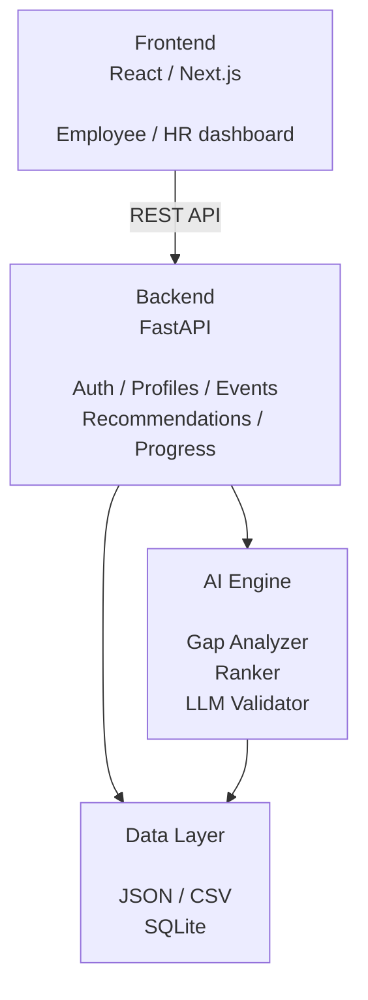

# Архитектура приложения Career Quest

Продуктовые решения, Career GPS, Recommendation Score и правила геймификации
зафиксированы в [`PRODUCT_PRINCIPLES.md`](PRODUCT_PRINCIPLES.md).

## Общая схема



```text
┌─────────────────────────────┐
│          Frontend           │
│      React / Next.js        │
│                             │
│ Employee / HR dashboard     │
└─────────────┬───────────────┘
              │ REST API
              ▼
┌─────────────────────────────┐
│           Backend           │
│         FastAPI             │
│                             │
│ Auth / Profiles / Events    │
│ Recommendations / Progress  │
└───────┬───────────┬─────────┘
        │           │
        ▼           ▼
┌────────────┐   ┌──────────────┐
│ Data Layer │   │ AI Engine    │
│            │   │              │
│ JSON / CSV │   │ Gap Analyzer │
│ SQLite     │   │ Ranker       │
│            │   │ LLM          │
└────────────┘   │ Validator    │
                 └──────────────┘
```

## Компоненты

### Frontend

Клиентское приложение на React и Next.js предоставляет два основных
интерфейса:

- кабинет сотрудника: профиль, карьерная цель, дефициты навыков, рекомендации
  и прогресс обучения;
- панель HR: состав команды, агрегированные дефициты, показатели мероприятий и
  охват рекомендациями.

Frontend не обращается к файлам или AI Engine напрямую. Все операции проходят
через REST API.

### Backend

FastAPI выступает единой точкой доступа к данным и бизнес-логике. Основные
модули:

- `Auth` — аутентификация и роли доступа `employee`, `manager`, `hr`;
- `Profiles` — профили сотрудников, навыки и карьерные цели;
- `Events` — каталог мероприятий и будущие сессии;
- `Recommendations` — получение и объяснение рекомендаций;
- `Progress` — история участия и показатели прохождения обучения.

Backend проверяет входные данные, применяет правила доступа, вызывает AI Engine
и возвращает клиенту стабильные DTO. Внутренние структуры JSON, CSV и SQLite не
передаются во frontend напрямую.

### Data Layer

Слой данных поддерживает два режима:

1. JSON и CSV используются как исходный набор и формат импорта.
2. SQLite используется приложением для запросов, связей и обновления прогресса.

Импорт должен быть повторяемым и идемпотентным. Идентификаторы из исходного
набора сохраняются как бизнес-ключи. Репозитории изолируют Backend и AI Engine
от конкретного способа хранения.

Основные сущности:

- `Employee`, `EmployeeSkill`, `CareerGoal`;
- `Skill`, `RoleProfile`, `RoleSkillRequirement`;
- `Event`, `EventSkillGain`, `EventPrerequisite`, `EventSession`;
- `ActivityRecord`, `Recommendation`.

### AI Engine

AI Engine состоит из трёх независимых этапов:

1. `Gap Analyzer` сравнивает текущие навыки с целевым профилем роли и грейда.
2. `Ranker` отбирает доступные мероприятия и сортирует их по критичности,
   полезному приросту и длительности.
3. `LLM Validator` проверяет и объясняет результат, но не изменяет фактические
   уровни навыков и не обходит детерминированные ограничения.

Детерминированный анализ остаётся источником истины. LLM получает только
необходимый контекст и возвращает структурированный результат, который Backend
проверяет по схеме перед выдачей пользователю.

## Основные потоки

### Получение рекомендаций

1. Frontend запрашивает рекомендации сотрудника через REST API.
2. Backend проверяет пользователя и право доступа к профилю.
3. Gap Analyzer рассчитывает дефициты относительно карьерной цели или текущего
   профиля.
4. Ranker исключает обязательные, недоступные, уже завершённые и неподходящие
   мероприятия.
5. LLM Validator формирует краткое объяснение на предпочитаемом языке.
6. Backend возвращает ранжированный список вместе с причинами рекомендации.

### Обновление прогресса

1. Сотрудник или HR создаёт либо обновляет запись участия.
2. Backend валидирует статус, процент завершения и допустимость перехода.
3. Data Layer сохраняет изменение в одной транзакции.
4. При завершении мероприятия Backend помечает рекомендации для пересчёта.
5. Новые уровни навыков применяются только после подтверждённой оценки, потому
   что история обучения и результат оценки имеют разные даты актуальности.

## Границы ответственности

- Frontend отвечает за представление и взаимодействие, но не рассчитывает
  рекомендации.
- Backend отвечает за безопасность, API-контракты и координацию сценариев.
- Data Layer отвечает за целостность и хранение, но не содержит UI-логики.
- Gap Analyzer и Ranker выполняют проверяемые расчёты без LLM.
- LLM Validator не принимает кадровые решения и не является источником
  фактических данных.

## Предлагаемая структура репозитория

```text
career-quest/
├── frontend/
│   ├── app/
│   ├── components/
│   └── lib/api/
├── backend/
│   ├── app/api/
│   ├── app/core/
│   ├── app/models/
│   ├── app/repositories/
│   ├── app/services/
│   └── tests/
├── ai_engine/
│   ├── gap_analyzer.py
│   ├── ranker.py
│   └── validator.py
├── career_quest_dataset/
├── scripts/
├── analysis/
└── ARCHITECTURE.md
```

## Нефункциональные требования

- API версионируется с префиксом `/api/v1`.
- Авторизация проверяется на Backend для каждого защищённого ресурса.
- Персональные данные не включаются в логи и запросы к LLM без необходимости.
- Расчёт рекомендаций должен воспроизводиться без LLM.
- Результаты LLM валидируются по JSON-схеме и имеют безопасный fallback.
- Импорт данных и миграции SQLite выполняются отдельно от запуска веб-сервера.
- Ключевые действия аудируются: изменение цели, навыков, статуса обучения и
  состава рекомендаций.
