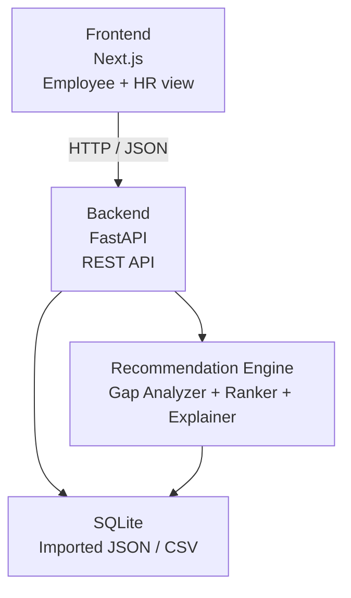

# План реализации Career Quest MVP

## 1. Цель

За 20–30 минут собрать минимальный сквозной прототип, который демонстрирует
главную ценность Career Quest:

```text
Сотрудник
  → видит текущий и целевой grade
  → видит главный skill gap
  → получает 1–3 объяснимые рекомендации
  → открывает Recommendation Score
  → отмечает активность завершённой
  → видит ожидаемое изменение траектории
```

Это демонстрационный MVP, а не production-система. Приоритет — работающий
основной сценарий и объяснимость рекомендации.

## 2. Ограничение объёма

В MVP входят:

- один экран сотрудника;
- один упрощённый HR-экран;
- выбор сотрудника из датасета;
- текущий и целевой grade;
- список skill gaps;
- одна основная рекомендация и до двух альтернатив;
- раскрываемый Recommendation Score;
- отметка активности как завершённой;
- пересчёт ожидаемого прогресса;
- SQLite, автоматически заполненная из JSON/CSV.

В MVP не входят:

- полноценная регистрация и OAuth;
- управление пользователями;
- внешняя LLM-интеграция;
- сложная ролевая модель;
- фоновые задачи и очереди;
- production-деплой;
- полноценная локализация;
- награды, магазин, публичные рейтинги и социальная механика;
- редактирование каталога мероприятий.

LLM не нужна для расчёта. Объяснение формируется детерминированно по шаблону.
Позже LLM сможет переформулировать готовые факты, не меняя результат.

## 3. Минимальная архитектура



### Frontend

Next.js показывает готовые данные API. Бизнес-логика и расчёт score во frontend
не дублируются.

Основные блоки:

- переключатель сотрудника;
- карточка `Current → Target`;
- список требований и skill gaps;
- карточка следующего действия;
- раскрытие составляющих score;
- кнопка завершения активности;
- компактный HR-view.

### Backend

FastAPI выполняет четыре задачи:

1. читает профили и историю из SQLite;
2. рассчитывает gaps;
3. фильтрует и ранжирует мероприятия;
4. обновляет участие и возвращает пересчитанный профиль.

### Recommendation Engine

Движок работает без LLM:

```text
Target profile
  → required skills
  → current skill levels
  → gaps
  → hard filters
  → score
  → top 3
  → template explanation
```

Hard filters исключают активность, если она:

- обязательная;
- не подходит целевой роли или grade;
- не проходит prerequisites;
- не развивает ни один gap;
- уже завершена и не является повторяемой;
- не имеет доступной сессии и не является self-paced.

Recommendation Score — прозрачный рейтинг, не вероятность:

| Компонент | Баллы |
|---|---:|
| Приоритет для цели | 0–30 |
| Сокращение gap | 0–25 |
| Соответствие истории | 0–20 |
| Реалистичность | 0–15 |
| Эффективность по времени | 0–10 |

### Data Layer

Исходные JSON/CSV остаются неизменными. При первом запуске импортируются в
SQLite. Для ускорения MVP импорт можно выполнять одной командой до старта API.

## 4. База данных

Файл базы:

```text
backend/data/career_quest.db
```

### Таблицы MVP

#### `employees`

| Поле | Тип | Назначение |
|---|---|---|
| `employee_id` | TEXT PK | ID сотрудника |
| `full_name` | TEXT | Имя из синтетического набора |
| `department` | TEXT | Отдел |
| `role` | TEXT | Текущая роль |
| `grade` | TEXT | Текущий grade |
| `manager_id` | TEXT NULL | Руководитель |
| `tenure_months` | INTEGER | Стаж |
| `work_format` | TEXT | Формат работы |
| `preferred_language` | TEXT | Язык интерфейса |
| `last_review_date` | TEXT | Дата оценки навыков |

#### `career_goals`

| Поле | Тип | Назначение |
|---|---|---|
| `employee_id` | TEXT PK/FK | Сотрудник |
| `target_role` | TEXT | Целевая роль |
| `target_grade` | TEXT | Целевой grade |

#### `skills`

| Поле | Тип | Назначение |
|---|---|---|
| `skill_id` | TEXT PK | ID навыка |
| `name` | TEXT | Название |
| `type` | TEXT | `hard` или `soft` |
| `category` | TEXT | Категория |
| `description` | TEXT | Описание |

#### `employee_skills`

| Поле | Тип | Назначение |
|---|---|---|
| `employee_id` | TEXT FK | Сотрудник |
| `skill_id` | TEXT FK | Навык |
| `level` | INTEGER | Подтверждённый уровень 0–5 |

Составной ключ: `(employee_id, skill_id)`.

#### `role_skill_requirements`

| Поле | Тип | Назначение |
|---|---|---|
| `role` | TEXT | Роль |
| `grade` | TEXT | Grade |
| `skill_id` | TEXT FK | Навык |
| `required_level` | INTEGER | Требуемый уровень |
| `is_critical` | INTEGER | Критический навык: 0/1 |

Составной ключ: `(role, grade, skill_id)`.

#### `events`

| Поле | Тип | Назначение |
|---|---|---|
| `event_id` | TEXT PK | ID активности |
| `title` | TEXT | Название |
| `description` | TEXT | Описание |
| `type` | TEXT | Тип |
| `format` | TEXT | Формат |
| `duration_hours` | REAL | Длительность |
| `mandatory` | INTEGER | Обязательность: 0/1 |

#### `event_targets`

| Поле | Тип | Назначение |
|---|---|---|
| `event_id` | TEXT FK | Активность |
| `role` | TEXT | Целевая роль |
| `grade` | TEXT | Целевой grade |

Составной ключ: `(event_id, role, grade)`.

#### `event_skill_gains`

| Поле | Тип | Назначение |
|---|---|---|
| `event_id` | TEXT FK | Активность |
| `skill_id` | TEXT FK | Развиваемый навык |
| `gain` | REAL | Ожидаемый прирост |
| `max_level` | INTEGER | Максимальный достижимый уровень |

Составной ключ: `(event_id, skill_id)`.

#### `event_prerequisites`

| Поле | Тип | Назначение |
|---|---|---|
| `event_id` | TEXT FK | Активность |
| `skill_id` | TEXT FK | Требуемый навык |
| `required_level` | INTEGER | Минимальный уровень |

Составной ключ: `(event_id, skill_id)`.

#### `event_sessions`

| Поле | Тип | Назначение |
|---|---|---|
| `event_id` | TEXT FK | Активность |
| `session_date` | TEXT | Дата будущей сессии |

Составной ключ: `(event_id, session_date)`.

#### `activity_records`

| Поле | Тип | Назначение |
|---|---|---|
| `record_id` | TEXT PK | ID записи |
| `employee_id` | TEXT FK | Сотрудник |
| `event_id` | TEXT FK | Активность |
| `date` | TEXT | Дата |
| `due_date` | TEXT NULL | Дедлайн |
| `status` | TEXT | Статус |
| `completion_pct` | INTEGER | Прогресс 0–100 |
| `score` | INTEGER NULL | Результат |
| `feedback_rating` | INTEGER NULL | Отзыв 1–5 |
| `assigned_by` | TEXT | Инициатор |

### Что не сохранять в MVP

Skill gaps, Recommendation Score и объяснение не нужно хранить отдельными
таблицами. Они пересчитываются из актуального профиля и истории. Это уменьшает
риск рассинхронизации и ускоряет реализацию.

## 5. REST API

| Метод | Endpoint | Результат |
|---|---|---|
| `GET` | `/api/v1/employees` | Краткий список сотрудников |
| `GET` | `/api/v1/employees/{id}/career` | Профиль, цель, gaps и top-3 рекомендаций |
| `POST` | `/api/v1/employees/{id}/events/{event_id}/complete` | Завершение активности и новый ожидаемый прогресс |
| `GET` | `/api/v1/hr/summary` | Дефициты, отсутствие рекомендаций и участие |
| `GET` | `/api/v1/health` | Проверка запуска API |

Главный endpoint `/career` возвращает всё необходимое для основного экрана
одним запросом, чтобы уложиться в ограничение времени и не собирать данные на
клиенте.

## 6. Планируемая структура файлов

Ниже перечислены файлы, которые будут созданы на этапе реализации. На этапе
планирования они не создаются.

```text
backend/
├── requirements.txt
├── data/
│   └── career_quest.db              # генерируется импортом
├── scripts/
│   └── import_dataset.py            # JSON/CSV → SQLite
├── app/
│   ├── __init__.py
│   ├── main.py                      # FastAPI и CORS
│   ├── database.py                  # SQLite connection
│   ├── schemas.py                   # API-модели
│   ├── repositories.py              # SQL-запросы
│   ├── recommendation.py            # gaps, filters, score
│   └── routes.py                    # endpoints
└── tests/
    └── test_recommendation.py

frontend/
├── package.json
├── next.config.js
├── app/
│   ├── layout.tsx
│   ├── page.tsx                     # Employee view
│   ├── hr/page.tsx                  # HR view
│   └── globals.css
├── components/
│   ├── CareerPath.tsx
│   ├── SkillGapList.tsx
│   ├── RecommendationCard.tsx
│   ├── ScoreBreakdown.tsx
│   └── HrSummary.tsx
└── lib/
    ├── api.ts
    └── types.ts

run.ps1                              # импорт при необходимости + два сервера
Plan.md
```

Если стартовый шаблон Next.js создаёт дополнительные служебные файлы, они
сохраняются. Перечень выше описывает файлы бизнес-логики MVP.

## 7. Последовательность реализации на 20–30 минут

### 0–3 минуты. Каркас и зависимости

- создать каталоги `backend` и `frontend`;
- установить минимальные зависимости;
- поднять пустой FastAPI endpoint `/health`;
- открыть минимальную страницу Next.js.

Результат: оба процесса запускаются.

### 3–8 минут. Импорт данных

- создать SQLite-схему;
- загрузить четыре файла датасета;
- нормализовать вложенные skills, targets, gains и prerequisites;
- проверить ожидаемые количества записей.

Результат: API может получить сотрудника, требования и мероприятия.

### 8–14 минут. Recommendation Engine

- определить целевой профиль;
- рассчитать gaps;
- применить hard filters;
- рассчитать прозрачный score;
- вернуть top-3 и массив факторов объяснения.

Результат: проверочный профиль получает воспроизводимые рекомендации.

### 14–20 минут. Employee view

- добавить выбор сотрудника;
- показать `Current → Target`;
- вывести требования и gaps;
- вывести основную рекомендацию и две альтернативы;
- добавить раскрытие score.

Результат: работает основной сценарий Career GPS.

### 20–24 минуты. Обновление прогресса

- реализовать endpoint завершения;
- добавить кнопку `Завершить`;
- после ответа обновить skill path;
- визуально разделить подтверждённый и ожидаемый уровень.

Результат: после действия пользователь видит изменение траектории.

### 24–27 минут. HR-view

- вывести пять частых gaps;
- показать сотрудников без рекомендаций;
- показать completion rate и статусы участия.

Результат: выполнен минимальный HR-сценарий.

### 27–30 минут. Проверка и запуск

- проверить три сложных профиля;
- проверить отсутствие обязательных мероприятий в рекомендациях;
- проверить раскрытие всех составляющих score;
- добавить одну команду запуска;
- проверить чистый запуск из README.

Результат: готов демонстрационный сквозной сценарий.

## 8. Порядок сокращения при нехватке времени

Если остаётся меньше 20 минут, сокращать в таком порядке:

1. убрать отдельный HR route и показать готовую сводку из `analysis/summary.json`;
2. оставить один frontend route с переключателем Employee/HR;
3. сократить SQLite до таблиц, необходимых read-only сценарию;
4. симулировать завершение активности только в рамках текущего процесса;
5. оставить один тестовый сотрудник по умолчанию с возможностью смены ID.

Нельзя сокращать:

- расчёт по нескольким факторам;
- hard filters;
- объяснение Recommendation Score;
- связь рекомендации с целевым grade;
- различие ожидаемого и подтверждённого прогресса.

## 9. Критерии готовности

MVP готов, если:

- запускается одной командой;
- принимает исходный датасет без ручного редактирования;
- открывает произвольного сотрудника;
- показывает текущую и целевую точку;
- показывает skill gaps;
- предлагает от одной до трёх допустимых активностей;
- раскрывает score на пять компонентов;
- не выдаёт score за вероятность;
- после завершения показывает ожидаемое изменение;
- HR-view показывает основные дефициты и участие;
- обязательные мероприятия не попадают в рекомендации;
- основной сценарий можно продемонстрировать менее чем за две минуты.

## 10. Решение перед началом разработки

Рекомендуемый порядок: сначала реализовать полностью детерминированный MVP по
этому плану. LLM, расширенную геймификацию и production-аутентификацию добавлять
только после работающего сквозного сценария.

До отдельного подтверждения пользователя реализация приложения не начинается.
