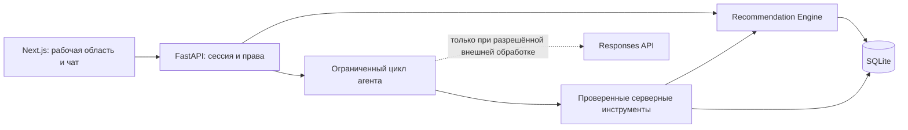

# Career Quest — карьерный навигатор с AI-агентом

Career Quest связывает обучение с карьерной целью сотрудника: показывает текущий уровень, дефициты навыков, объясняет следующий шаг и пересчитывает ожидаемый прогресс после выполнения активности. HR получает срез по своему отделу: частые дефициты, отсутствие подходящих рекомендаций и участие в обучении.

**Статус:** локальный MVP на синтетическом датасете. Интерфейс, расчёты, инструменты агента и проверки доступа реализованы. По умолчанию работает локальный помощник без внешней LLM; интеграция с моделью включается отдельно. Реальный вызов провайдера при проверке проекта не выполнялся.

## 1. Какие проблемы решает проект

| Пользователь и проблема | Решение | Что можно проверить |
|---|---|---|
| Сотрудник не понимает свой уровень и пользу очередного HR-события | Полная карта навыков, карьерный маршрут, 1–3 объяснимых шага | Уровень и требования видны рядом; рекомендация связана с целью, разрывами и историей |
| HR не видит, где обучение не закрывает потребности | Дефициты отдела, сотрудники без следующего шага и причины, участие по событиям | Показатели рассчитываются по разрешённому отделу; отсутствие маршрута объясняется фильтрами |

Геймификация — личные квесты, видимый путь и отметки завершения. Публичного рейтинга сотрудников нет. Завершение квеста не означает автоматического повышения грейда. Экономия бюджета и рост вовлечённости пока не подтверждены пилотом.

## 2. Быстрый запуск с нуля

### Требования

- Windows и PowerShell для запуска одной командой через `run.ps1`.
- Python **3.11+**: используется `asyncio.timeout`.
- Node.js **20.9+**, npm.
- Интернет для первоначальной установки зависимостей. После установки локальный режим не требует ключа модели.
- Порты `3000` и `8000` должны быть доступны.

Откройте терминал **в корне репозитория** — каталоге, содержащем этот README и `run.ps1`. Все команды ниже выполняются из корня, если явно не указан другой каталог.

### Первоначальная подготовка

```powershell
python --version
node --version
npm --version

python -m venv .venv
.\.venv\Scripts\Activate.ps1
python -m pip install -r backend/requirements.txt
Push-Location frontend
npm ci
Pop-Location
```

`npm ci` устанавливает зависимости по `frontend/package-lock.json`. Python-пакеты задаются в `backend/requirements.txt`; полный lock-файл Python-зависимостей пока отсутствует.

### Запуск

```powershell
.\run.ps1
```

Откройте вручную:

- [Приложение](http://127.0.0.1:3000)
- [Интерактивная документация API](http://127.0.0.1:8000/docs)
- [Проверка backend и SQLite](http://127.0.0.1:8000/api/v1/health)

Скрипт создаёт SQLite, если файла ещё нет, устанавливает frontend-зависимости при отсутствии `node_modules`, запускает сервисы и проверяет ответы. Если оба сервиса уже работают, повторно не запускает их. `Ctrl+C` останавливает процессы, созданные этим запуском; ранее запущенные сервисы остаются работать.

Файлы `.env` для локального демо **не обязательны**. Данные загружаются из репозитория, первый профиль — `E0001`.

### Ручной запуск для диагностики

Откройте два терминала в корне проекта, активируйте `.venv` в терминале backend.

Терминал 1:

```powershell
.\.venv\Scripts\Activate.ps1
python -m uvicorn backend.app.main:app --host 127.0.0.1 --port 8000
```

Терминал 2:

```powershell
cd frontend
npm run dev -- --hostname 127.0.0.1 --port 3000
```

Backend автоматически импортирует исходный набор, если база отсутствует или не содержит профилей. Для запуска на другой ОС используйте ручные команды и соответствующий способ активации виртуального окружения; сценарий одной командой проверялся на Windows.

## 3. Основной сценарий для демонстрации

### Сотрудник: от уровня к следующему действию

1. Откройте главную страницу. В локальном демо выберите профиль в сайдбаре; для воспроизводимого старта используйте `E0001` в исходной базе.
2. Откройте **«Карта навыков»**: видны подтверждённые уровни, требования цели и ожидаемый прирост. Освоенные навыки тоже включены.
3. Напишите **«Построй маршрут»**. В центре появится маршрут, в чате — объяснение и ссылки на разделы с исходными данными.
4. Раскройте **«Почему этот шаг подходит мне»** и **«Выполненные инструменты»**. Видны факторы score и фактически исполненные серверные функции.
5. Напишите **«У меня 30 минут»**. Допустимые варианты пересчитываются. Если их нет, система объясняет ограничение, не придумывая курс.
6. Напишите **«Построй маршрут без ограничений»**. Выберите доступный квест, нажмите **«Отметить выполненным»** и подтвердите.
7. Проверьте историю и карту: ожидаемые уровни пересчитаны, подтверждённые уровни и грейд не изменились. Повторное завершение не начисляет прирост второй раз.

Для учебного объяснения используйте **«Объясни <название навыка с карты> на примере»**. Пример явно отделён от корпоративной записи и не начисляет уровень навыка.

### HR: найти пробел в программе развития

1. В локальном демо переключите режим на **«HR · мой отдел»**.
2. Откройте **«Пульс команды»** или спросите **«Какие навыки проседают в команде?»**.
3. Спросите **«У кого нет следующего шага?»**. Проверьте причины: отсутствие сессии, несоответствие требованиям, уже пройденные активности и другие фильтры.
4. Откройте **«Участие»**: показаны количества участий и завершений по событиям. Повторные участия учитываются как отдельные записи.

HR видит отдел выбранного демопрофиля, а не всю организацию. Если в этом отделе нет сотрудников без рекомендаций, интерфейс показывает пустое состояние; для другого отдела выберите другой синтетический профиль. Переключение очищает диалог и создаёт новую сессию.

## 4. Технологии и устройство проекта

| Слой | Технологии | Ответственность |
|---|---|---|
| Интерфейс | Next.js 16.3.6, React 19.3.0, TypeScript 5.5.4, CSS | Сайдбар, карта, квесты, HR-представления, чат |
| API | Python, FastAPI 0.111.0, Uvicorn 0.30.1 | Сессии, проверки доступа, REST, координация инструментов |
| Расчёты | Python, детерминированный recommendation engine | Требования, фильтры, score, ожидаемый прогресс |
| Данные | SQLite, исходные JSON/CSV | Профили, навыки, мероприятия, история |
| AI-интеграция | HTTPX, Responses API, function calling | Выбор ограниченных серверных инструментов моделью |
| Проверки | unittest, FastAPI TestClient, TypeScript, Next.js build | API, права, расчёты, агентный цикл и сборка |



Backend остаётся единой точкой доступа. Frontend не рассчитывает score и не отправляет ключ модели. Визуальный результат строится готовыми React-компонентами из проверенных данных; сгенерированные HTML, JavaScript и SQL не исполняются.

```text
backend/
  app/
    main.py              # FastAPI, CORS и заголовки приватных ответов
    routes.py            # REST endpoints
    auth.py              # Сессии, роль и область доступа
    config.py            # Серверные переменные окружения
    recommendation.py    # Фильтры, score, прогресс, HR-агрегаты
    assistant.py         # Локальные команды и цикл вызова модели
    agent_tools.py       # Инструменты, схемы, проверка визуального результата
    database.py          # Соединения SQLite
  scripts/import_dataset.py
  tests/test_recommendation.py
  .env.example
frontend/
  app/                   # Страницы / и /hr, общие стили
  components/QuestApp.tsx # Сессия, сайдбар, рабочая область, чат
  components/QuestViews.tsx
  lib/                   # API-клиент и типы данных
career_quest_dataset/    # Исходный синтетический набор
scripts/analyze_dataset.py
analysis/               # Отдельный аналитический отчёт
run.ps1
```

Дополнительные документы: [архитектурные принципы](ARCHITECTURE.md), [продуктовые принципы](PRODUCT_PRINCIPLES.md), [план и статус реализации](Plan.md). Эти документы включают целевые решения; реализованные возможности и ограничения перечислены в этом README.

## 5. Рекомендации и прогресс

Если есть карьерная цель, требования берутся для неё; иначе — для текущей роли и грейда с явной отметкой, что цель не выбрана.

Перед ранжированием исключаются обязательные мероприятия, неподходящие роль/грейд, невыполненные prerequisites, отсутствие полезного прироста и доступной сессии (кроме self-paced). Завершённые события исключаются, кроме регулярного `EV_036`. При запросе агента дополнительно проверяются время и формат.

| Компонент Recommendation Score | Максимум |
|---|---:|
| Приоритет для цели и критичность | 30 |
| Сокращение дефицита | 25 |
| Соответствие истории участия | 20 |
| Реалистичность нагрузки | 15 |
| Польза за затраченное время | 10 |

Score — оценка соответствия, **не вероятность повышения**. История учитывает завершения/пропуски типов и форматов, а также отзывы. Пользователь получает до трёх рекомендаций с факторами объяснения.

Готовность рассчитывается по **всем** требованиям целевого профиля. После завершения активностей ожидаемый прирост применяется последовательно с учётом `gain`, `max_level` и общего предела 5; уже подтверждённый уровень не понижается. Историческое обучение из исходного набора повторно не начисляется: прогноз использует записи, созданные приложением (`assigned_by=career_quest`).

## 6. Агент: что именно реализовано

| Инструмент | Результат |
|---|---|
| `get_my_context` | Собственный профиль без имени, требования и краткие агрегаты истории |
| `find_development_options` | Допустимые активности с ограничениями времени/формата |
| `simulate_route` | Прогноз изменения навыков без записи в базу |
| `get_skill_guide` | Определение навыка и помеченное учебное упражнение |
| `present_artifact` | Проверенная карта, маршрут или другое разрешённое представление |
| `get_team_gaps` | HR-агрегаты разрешённого отдела |
| `get_coverage_gaps` | Причины отсутствия рекомендаций для HR |

В AI-режиме модель выбирает последовательность функций. Сервер проверяет аргументы, права и порядок действий, возвращает результат инструмента и продолжает цикл. Лимиты: до 3 обращений к модели, до 6 вызовов инструментов, 9 секунд на внешний цикл; повторяющиеся вызовы ограничены. При сбое применяется локальный сценарий с явной отметкой `fallback`.

**Фактический текст объяснения сейчас формируется сервером из проверенных данных.** Модель управляет выбором инструментов и представления; свободный генеративный диалог и произвольные учебные ответы не реализованы. В локальном режиме команды распознаются правилами, а не LLM. Учебные упражнения тоже шаблонные.

Панель показывает реальные вызовы функций и их длительность. Ограничения времени/формата сохраняются в серверной сессии; полный диалог отображается в браузере, но не передаётся модели как долговременная память. Агент не записывает изменения: выполнение активности требует отдельного подтверждения в интерфейсе.

## 7. Конфигурация и доступ к данным

Для изменения настроек создайте `backend/.env` по [шаблону](backend/.env.example), не перезаписывая существующий файл с секретами.

| Переменная | По умолчанию | Назначение |
|---|---|---|
| `CQ_MODE` | `demo` | `demo` — локальные синтетические профили; `private` — тестовые коды доступа |
| `CQ_ALLOW_EXTERNAL_AI` | `false` | Разрешение внешней обработки моделью |
| `OPENAI_API_KEY` | Не задан | Серверный ключ; нужен только для AI-режима |
| `OPENAI_MODEL` | `gpt-4.1-mini` | Модель с поддержкой используемых инструментов; доступ зависит от аккаунта |
| `CQ_EMPLOYEE_ACCESS_CODE` | Не задан | Код тестового сотрудника, минимум 16 символов |
| `CQ_HR_ACCESS_CODE` | Не задан | Независимый код тестового HR, минимум 16 символов |
| `CQ_EMPLOYEE_ID` | `E0001` | Профиль тестового аккаунта в private-режиме |
| `CQ_HR_DEPARTMENT` | Отдел профиля, если переменная отсутствует | Область HR; при настройке задайте точное непустое название отдела |
| `NEXT_PUBLIC_API_URL` | `http://localhost:8000/api/v1` | Адрес API для frontend; задаётся в `frontend/.env` |

Приоритет серверных настроек: переменные процесса → `backend/.env` → корневой `.env` → `frontend/.env`. Последний поддерживается для совместимости с ранее размещённым ключом. Ключ не должен иметь префикс `NEXT_PUBLIC_`. После изменения серверных настроек перезапустите backend; при изменении публичного адреса frontend перезапустите его или пересоберите production-версию.

**Внешняя модель:** кейс запрещает вынос датасета за пределы хакатона. Включайте `CQ_ALLOW_EXTERNAL_AI=true` только если выбранный контур обработки разрешён владельцем данных/организаторами. Наличие ключа не снимает ограничение. Имена и сырая история не входят в контекст инструментов, однако сообщение пользователя и необходимые сведения о навыках могут передаваться провайдеру. `store=false` не означает гарантированного отсутствия любой обработки/хранения на стороне провайдера.

**Права:** сотрудник получает свой профиль; HR — разрешённый отдел и собственный профиль. Проверка выполняется сервером, включая инструменты агента. В локальном демо переключатель позволяет исследовать синтетические профили; это не корпоративная авторизация.

Сессии живут в памяти одного процесса до 8 часов, Bearer-токен — в памяти страницы. Перезапуск backend аннулирует сессии. Используйте **один worker**. Лимит чата — 20 запросов в минуту на сессию, длина сообщения до 2000 символов, один активный запрос на сессию.

Private-режим — два тестовых аккаунта, не production IAM. Для реальных персональных данных необходимы полноценная идентификация, HTTPS, ограничение попыток входа, аудит и согласованный внутренний контур. Не публикуйте демосервер через публичный прокси.

## 8. Данные и повторяемость

Исходный набор: **200 сотрудников, 60 навыков, 40 мероприятий, 2743 записи участия**. Описание схемы: [README набора на русском](career_quest_dataset/README.ru.md).

| Файл | Содержимое |
|---|---|
| `employees.json` | Профили, подтверждённые навыки и карьерные цели |
| `skills.json` | Навыки и требования по ролям/грейдам |
| `events.json` | События, прирост, пределы, prerequisites и сессии |
| `activity_history.csv` | История участия за 24 месяца |

Дата среза фиксирована в расчётах: **2026-10-01**, история — **2024-10-01 — 2026-09-30**. Доступность событий определяется относительно этого среза, а не системной даты компьютера.

Рабочая SQLite создаётся в `backend/data/career_quest.db`; изменения выполнения сохраняются между перезапусками. Исходные JSON/CSV не изменяются.

### Возврат к исходному состоянию

**Команда ниже пересоздаёт таблицы и удаляет накопленный прогресс приложения.** Выполняйте только для осознанного сброса демонстрации, остановив backend и предварительно сохранив нужную копию БД:

```powershell
python backend/scripts/import_dataset.py
```

После этого запустите приложение заново. Этот импортёр не предназначен для добавления профилей в существующую БД. Добавочный импорт профилей/истории жюри пока не реализован; замена входного набора с сохранением схемы требует полного повторного импорта.

### Отдельный аналитический отчёт

```powershell
python scripts/analyze_dataset.py
```

Команда проверяет исходный набор и перезаписывает `analysis/REPORT.md`, `summary.json` и CSV-выгрузки. Она не читает накопленный прогресс рабочей SQLite. Аналитический скрипт имеет отдельное ранжирование и может возвращать до пяти рекомендаций; его числа нельзя автоматически приравнивать к текущему top-3 API.

## 9. Как проверить решение

### Автоматические проверки

В корне проекта, с активированным окружением:

```powershell
python -m unittest discover -s backend/tests -v
Push-Location frontend
npm run build
Pop-Location
```

Ожидается `Ran 5 tests ... OK` и успешная сборка страниц `/` и `/hr`. Тесты используют отдельную временную SQLite, не сбрасывают рабочую базу.

Покрытие: запрет чужого профиля и HR-данных сотруднику; область HR; полная карта требований; сохранение/сброс ограничения времени; повторное выполнение и пределы прироста; агентный цикл с **имитацией ответов модели** и fallback при таймауте. Эти тесты не являются проверкой качества реального внешнего провайдера.

### Проверка работающего API без браузера

В отдельном PowerShell-терминале при работающем приложении в demo-режиме:

```powershell
$baseUrl = 'http://127.0.0.1:8000/api/v1'
Invoke-RestMethod "$baseUrl/health"

$session = Invoke-RestMethod "$baseUrl/session" -Method Post -ContentType 'application/json' -Body '{"employee_id":"E0001","role":"employee"}'
$headers = @{ Authorization = "Bearer $($session.token)" }
$body = @{ message = 'Покажи карту навыков' } | ConvertTo-Json
$result = Invoke-RestMethod "$baseUrl/assistant" -Method Post -Headers $headers -ContentType 'application/json; charset=utf-8' -Body ([Text.Encoding]::UTF8.GetBytes($body))
$result.mode
$result.artifact.kind
$result.trace | Format-Table tool,status,ms

Invoke-RestMethod "$baseUrl/session" -Method Delete -Headers $headers
```

В настройках по умолчанию ожидается `local`, `skill_map`, инструменты со статусом `ok`. Токен сессии не нужно публиковать.

### Зафиксированная проверка 23 сентября 2026

- Production-сборка Next.js и TypeScript прошли.
- Все 5 серверных тестов прошли.
- Главная страница, `/hr` и `/api/v1/health` вернули HTTP 200.
- Живые локальные запросы карты, маршрута, ограничения 30 минут и HR-покрытия прошли.
- Повторный `run.ps1` обнаружил уже работающие сервисы.
- Внешняя LLM не вызывалась; визуальная браузерная проверка не завершена из-за ошибки инструмента среды. HTTP 200 не заменяет визуальную проверку.

## 10. Основные endpoints

Все пути имеют префикс `/api/v1`. Для защищённых запросов нужен `Authorization: Bearer <token>`.

| Метод и путь | Назначение / доступ |
|---|---|
| `GET /health` | Состояние API и базы |
| `GET /config` | Публичные настройки режима без секретов |
| `GET /demo/profiles` | Синтетические профили; только локальное демо |
| `POST /session` | Создать серверную сессию |
| `DELETE /session` | Завершить текущую сессию |
| `GET /employees` | Список в пределах прав |
| `GET /employees/{id}/career` | Профиль, карта, рекомендации, история и прогресс |
| `POST /employees/{id}/events/{event_id}/complete` | Завершить собственную допустимую активность |
| `GET /hr/summary` | HR-сводка разрешённого отдела |
| `POST /assistant` | Сообщение, инструменты и визуальный результат |

Точные схемы доступны в [Swagger UI](http://127.0.0.1:8000/docs). Ошибки: `401` — нет действующей сессии; `403` — нет прав; `409` — конфликт/действие недоступно; `422` — неверный запрос; `429` — лимит запросов.

## 11. Если приложение не запускается

| Симптом | Что проверить |
|---|---|
| `ModuleNotFoundError` | Активировано ли `.venv`; повторите `python -m pip install -r backend/requirements.txt` |
| PowerShell блокирует `.ps1` | Используйте ручной запуск: `.venv\Scripts\python.exe -m uvicorn backend.app.main:app --host 127.0.0.1 --port 8000` и `npm run dev` в отдельном терминале frontend |
| Не удаётся соединиться с API | Откройте `/api/v1/health`; проверьте порт 8000 и `NEXT_PUBLIC_API_URL` |
| `EADDRINUSE` / `EACCES` при старте | Порт занят или недоступен. Сначала проверьте уже работающий адрес; не запускайте второй сервер на том же порту |
| `spawn EPERM` при сборке | Среда блокирует дочерние процессы Node.js. Выполните `npm run build` в разрешённом локальном терминале; не отключайте проверку TypeScript |
| После рестарта появляется `401` | Обновите страницу/войдите заново: сессии хранятся в памяти backend |
| HR-сводка пустая в private-режиме | Задайте непустой `CQ_HR_DEPARTMENT`, точно совпадающий с отделом в наборе |
| Чат пишет «Локальный ответ» | Это ожидаемо при выключенном внешнем AI. Для интеграции проверьте разрешение на обработку и серверные переменные |
| Чат пишет «Резервный локальный ответ» | Провайдер не завершил проверенный цикл: проверьте ключ, доступ к модели и сеть без публикации секретов |
| Нет доступных квестов | Это допустимый результат фильтров. Сбросьте ограничение времени и посмотрите объяснение; не каждое требование закрывается имеющимся каталогом |

## 12. Границы текущей версии

Нет SSO, production-деплоя, фоновой автономной работы, записи на события, базы корпоративных документов, постоянной памяти диалогов и добавочного импорта жюри. Завершение события идемпотентно по паре сотрудник/событие: отдельное повторное прохождение клуба `EV_036` пока не моделируется, хотя ранжирование допускает этот клуб повторно.

Маршрут показывает ближайшую допустимую активность и оставшиеся требования, а не гарантированный полный учебный план. Визуальный сценарий, безопасность пилота и качество реального AI требуют дальнейшей проверки перед использованием с настоящими сотрудниками.
