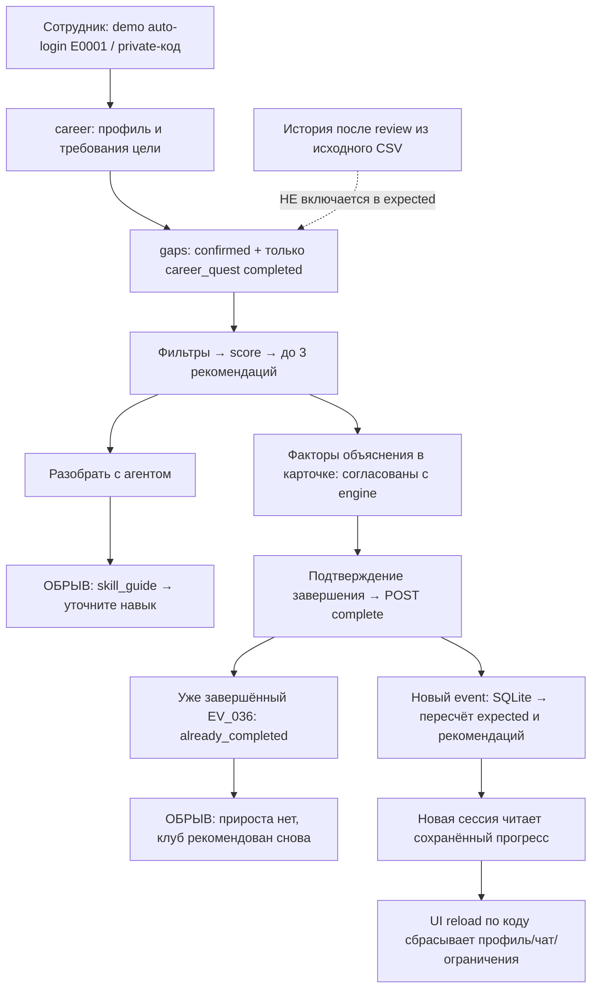
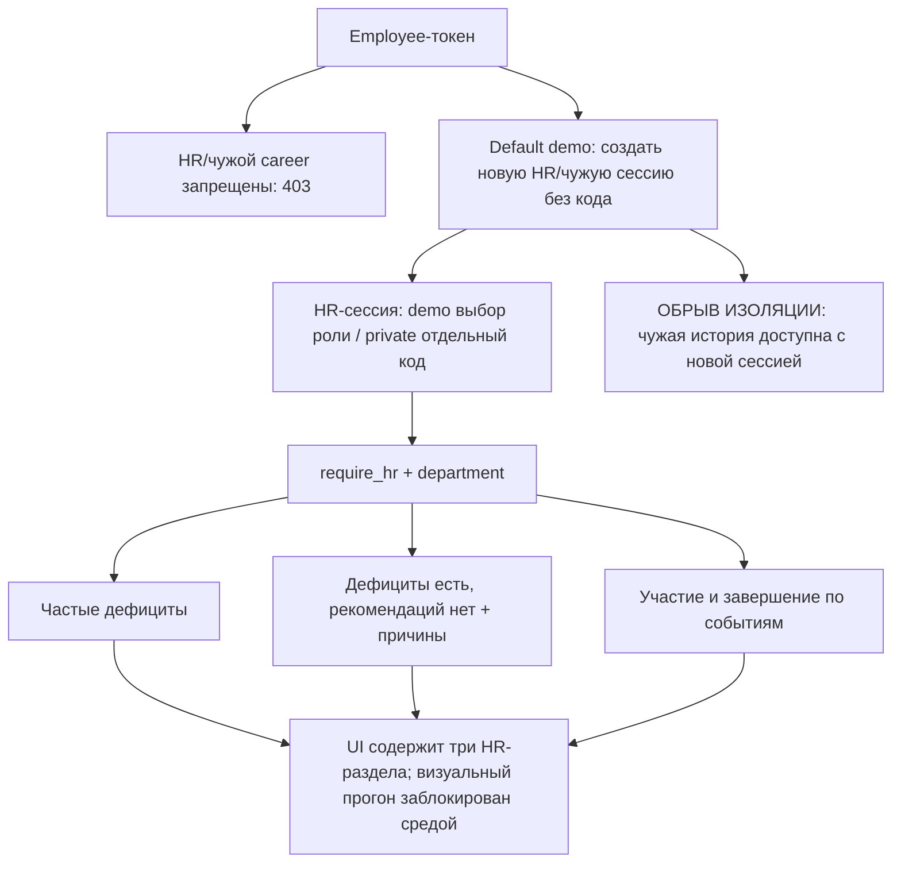

# Независимый аудит Career Quest

Дата: 23 сентября 2026. Дата среза датасета, используемая приложением: 1 октября 2026.

**Вердикт:** основа MVP работает через API: профиль, ранжирование, числовые объяснения, однократное завершение активности, сохранение прогресса и HR-агрегаты. Готовность сквозной демонстрации не подтверждена. Обнаружены воспроизводимые ошибки кнопки объяснения, повторного клуба и учёта истории; дополнительный импорт без пересоздания БД отсутствует. Изоляция сотрудников действует внутри сессии, но не между пользователями локального деморежима.

Исходный код и рабочая БД не исправлялись. Проверки с завершением активностей выполнялись в отдельной `audit/isolated.db`. Рабочее приложение использовалось для чтения, создания тестовых сессий и запросов локальному помощнику. До аудита в рабочей БД уже была запись `E0175 / EV_011 / career_quest`; она сохранена.

## 1. Границы доказательств

Изучены README проекта, README.ru.md стартового датасета, Plan.md, продуктовые принципы, схема SQL импортёра, backend, активные компоненты frontend, API-клиент и команды запуска. Стек: Next.js/React/TypeScript → FastAPI → SQLite; расчёт детерминированный; внешний AI выключен (`/config: ai_enabled=false`).

Отдельное приложенное ТЗ, точные названия пяти критериев жюри и оригинальный конфликтный/дополнительный профиль в доступной папке не найдены. Поэтому:

- Матрица баллов ниже — **условная предварительная оценка**, с предложенными названиями критериев и заданными пользователем весами 25/25/25/15/10. Это не выдаётся за официальную оценочную форму.
- Must-have восстановлены по запросу пользователя и правилам стартового датасета. Полнота относительно отсутствующего ТЗ не гарантируется.
- Конфликтный профиль E9001 создан аудитором по описанию пользователя. Это **суррогат, а не профиль из ТЗ**. Дополнительный E9002 также тестовый, а не файл жюри.
- «Подтверждено API» не означает «пройдено в интерфейсе». Встроенный браузер остался на «Подключаемся к Career Quest…». Управление локальным Edge остановлено инструментом из-за невозможности надёжно определить URL. Причина зависания встроенного браузера не установлена; это **не доказанный дефект проекта**.
- Изменения пользователя уже присутствовали в восьми файлах до проверки (`.gitignore`, Plan.md, README.md, database.py, import_dataset.py, test_recommendation.py, tsconfig.tsbuildinfo, run.ps1). Они не откатывались. Аудируется рабочее дерево, а не чистый commit.

Доказательства: [audit/results.json](<C:/Users/molda/OneDrive/Desktop/Course_Ai/Кейсы/Пример 1/audit/results.json>), воспроизводящий сценарий [audit/probe.py](<C:/Users/molda/OneDrive/Desktop/Course_Ai/Кейсы/Пример 1/audit/probe.py>), дополнительные профили [audit/additional_profiles.json](<C:/Users/molda/OneDrive/Desktop/Course_Ai/Кейсы/Пример 1/audit/additional_profiles.json>). Скрипт запускать из корня: `python -m audit.probe`. Он пересоздаёт только свою тестовую БД и fixture внутри `audit/`; внешнюю модель не вызывает.

## 2. Предварительные баллы

Баллы за непроверенный UI и реальную LLM не начислялись как за подтверждённые возможности. Названия строк — рабочее допущение аудитора до получения официального ТЗ.

| Условный критерий | Балл / максимум | Конкретные основания |
|---|---:|---|
| Полнота пользовательских сценариев | **18/25** | E0001 получает три активности, завершение EV_005 меняет ожидаемую готовность 2→4 из 15 и оставшийся разрыв 16→14; новая сессия читает тот же результат. HR API отдаёт все три требуемых среза. Вычеты: неработающее объяснение через CTA, тупик повторного клуба, неполный показ текущих навыков/следующего грейда. |
| Качество рекомендаций и объяснимость | **16/25** | На E9001 лидируют EV_007=50 и EV_006=48 перед Public Speaking Club=47; суммы компонентов сходятся. Проверены 393 рекомендации, ошибок полезного `gain` не найдено. Вычеты: неучтённая история после оценки у 111 исходных профилей; фильтр допуска по целевому грейду; объяснение не раскрывает конкретные пропуски; реальная LLM не проверена. |
| UX и наглядность результата | **13/25** | В коде есть карта, шкалы, маршрут, три альтернативы, факторы score, подтверждение завершения, пустые состояния и HR-таблица. Но визуально путь не пройден; кнопка «Разобрать с агентом» ведёт не туда; контекст профиля/маршрута не сохраняется при перезагрузке. Это оценка реализации, не визуального качества. |
| Техническая надёжность и доступ | **10/15** | 7 существующих тестов проходят; TypeScript проверен. 401/403/404/422 воспроизведены, операция завершения идемпотентна, SQLite сохраняет результат. Вычеты: деморежим позволяет самостоятельно получить HR/чужую сессию; нет таймаута начального fetch; повторный клуб конфликтует с идемпотентностью. |
| Воспроизводимость и готовность демонстрации | **6/10** | README описывает подготовку, `run.ps1` успешно распознаёт уже работающие сервисы. API быстро отвечает, тестовый расширенный датасет импортирован. Вычеты: добавочный импорт отсутствует, запуск с чистой машины не проверен, UI SLA и официальный конфликтный профиль не подтверждены. |
| **Всего по условной матрице** | **63/100** | Пересчитать после получения официальных критериев и успешного браузерного прогона. |

## 3. Статус must-have

«Работает» ниже относится к указанному уровню проверки. Непроверенная возможность не помечена отсутствующей.

| Must-have из запроса / стартового кита | Статус | Доказательство и ограничение |
|---|---|---|
| Открыть собственный профиль | **работает** | GET career возвращает сотрудника, грейд, дату оценки и цель; UI-переход не подтверждён. |
| Увидеть текущие навыки | **частично** | У E0001 в БД 23 навыка, в карте/API только 15 требований целевого профиля. Остальные текущие навыки не показаны. |
| Требования следующего грейда | **частично** | Есть требования явно заданной цели. При `career_goal=null` показан текущий грейд, автоматического выбора следующего нет. |
| Получить 1–3 рекомендации | **работает** | E0001: EV_005, EV_036, EV_037. Нулевой результат при несовместимых ограничениях допустим и объясняется. Корректность всех входных уровней отдельно ограничена P1-01. |
| Объяснение соответствует расчёту | **частично** | Факторы и score согласованы с engine; кнопка разбора не выдаёт объяснение шага, история описана общими словами. |
| Завершить активность | **частично** | Обычная активность записывается один раз; повторяемый EV_036 второй раз не засчитывается. |
| Пересчитать навыки и траекторию | **частично** | Меняются ожидаемые уровни, список рекомендаций и готовность; подтверждённые уровни и грейд не меняются. Исторический прирост после review пропущен; prerequisites берутся только из подтверждённых навыков. |
| `gain`, `max_level`, предел 5 | **работает** | 393 рекомендации без расхождения полезного прироста; отдельная проверка запрещает понижение при current > max_level; существующий тест проверяет большой gain. Входная история при этом неполна. |
| Учитывать критичность и пропуски | **частично** | Суррогат конфликта ранжируется разумно; история типа/формата учитывается, но отсутствие опыта и реальные пропуски могут получать одинаковый балл. Оригинальный профиль ТЗ не доступен. |
| Загружать дополнительные профили/историю того же формата | **частично** | Полная замена набора через импортёр работает: 202 профиля, 2746 исторических записей. Добавочный импорт без сброса **отсутствует**. |
| HR: проседающие компетенции | **работает** | В рабочем отделе Cloud Platforms — 22 сотрудника, Mentoring и System Design — по 21. Корректность дефицитов зависит от P1-01. |
| HR: сотрудники без следующего шага | **работает** | Рабочая БД: E0175, E0026, E0140, с причинами исключения активностей. Это сотрудники с дефицитами и без рекомендаций, а не все люди без карьерной цели. |
| HR: участие по активностям | **работает** | 530 записей, 410 завершённых, 77,4%; EV_036: 25 участий / 15 завершений. Подсчёт SQL совпал. Таблица предусмотрена в UI; чат не умеет открыть этот раздел по фразе «Покажи участие по активностям». |
| Сотрудник не видит HR и чужую историю | **частично** | С employee-токеном — 403. Но в default demo можно без кода создать HR-сессию или сессию E0002. В private-режиме проверенные попытки обхода отклонены. |
| Ошибки и пустые состояния | **частично** | API обрабатывает отсутствие прав, неверный ввод, неизвестный event; UI содержит error/empty states. Нет подтверждённого browser-теста сетевых ошибок; начальная загрузка без таймаута. |
| Сохранение результата после обновления | **частично** | Завершение/прогресс сохраняются в SQLite и доступны новой сессии. Фактический browser reload не пройден; выбранный профиль, чат, ограничения и раздел по коду сбрасываются. |
| Запуск одной командой | **частично** | `run.ps1` работает для подготовленной среды; Python-зависимости устанавливаются отдельно. Проверен только повторный запуск при работающих серверах. |
| Интерфейс ≤2 секунд | **частично — не подтверждено** | HTTP-скорость не равна времени от клика до отрисовки. UI измерить не удалось. |
| Рекомендации ≤10 секунд | **работает локально** | Три живых запроса помощнику: 14,09–31,44 мс. Реальная LLM/сеть и нагрузка не проверены. |
| Реальный AI-агент, если обязателен в ТЗ | **частично** | В коде есть Responses API и цикл инструментов; в текущем запуске используются локальные правила, внешний вызов не выполнялся. |

## 4. Фактический прогон сценариев

### Сотрудник: обычный E0001

В исходном наборе E0001 — Backend Engineer Junior, цель Middle; 15 целевых требований, 2 уже подтверждены. На первом запросе доступны:

| Активность | Score | Компоненты: приоритет / разрыв / история / нагрузка / польза за время |
|---|---:|---|
| EV_005 System Design Fundamentals | 53 | 28 + 3 + 11 + 9 + 2 |
| EV_036 Public Speaking Club | 51 | 18 + 2 + 11 + 15 + 5 |
| EV_037 Mentor Track | 44 | 18 + 2 + 11 + 11 + 2 |

Завершение EV_005 через API в изолированной БД: System Design 1→2 ожидаемо; API Design 2→3 ожидаемо. Ожидаемая готовность 2→4/15, разрыв 16→14. Подтверждённые навыки, грейд и дата оценки не меняются. Следующие рекомендации: EV_036=51, EV_037=44, EV_009=42. Повторный POST возвращает `already_completed=true`, повторного прироста нет. Новая сессия получает ту же историю и progress.

«Построй маршрут» возвращает route с расчётным объяснением. «У меня 30 минут» даёт пустой набор и причины; сброс снимает ограничение. Но точная команда кнопки «Разобрать с агентом» возвращает `skill_map` и просьбу уточнить навык. Сквозной UI-путь не засчитывается как пройденный.

### Конфликтный профиль — суррогат E9001

Параметры доступны в additional_profiles.json: Backend Engineer Middle → Senior; остальные требования Senior удовлетворены; System Design=2 при критическом требовании 4; Public Speaking=0 при требовании 2. Добавлены три `no_show` для EV_036. Это контролируемая проверка описанного конфликта, не реконструкция отсутствующего оригинала.

| Активность | Score | Приоритет / разрыв / история / нагрузка / эффективность |
|---|---:|---|
| EV_007 Architecture Review Circle | **50** | 26 + 6 + 3 + 13 + 2 |
| EV_006 Designing High-Load Systems | **48** | 26 + 6 + 3 + 11 + 2 |
| EV_036 Public Speaking Club | **47** | 18 + 6 + 3 + 15 + 5 |

System Design действительно выбран раньше более слабого Public Speaking. Объяснение EV_007 верно называет System Design 2/4 критическим, прирост дефицита 1, длительность 8 часов, history_fit 3/20. Однако все три кандидата имеют одинаковые 3/20: нет завершений соответствующих типов/форматов, нет рейтингов → `0 + 0 + 5×0,6 = 3`. Алгоритм здесь **не различает отсутствие истории mentoring и три пропуска клуба**. Нельзя утверждать, что именно пропуски обеспечили правильный выбор: его обеспечили преимущественно критичность и другие компоненты.

После первого выполнения клуба Public Speaking ожидаемо 0→1, после второго остаётся 1, хотя клуб продолжает рекомендоваться и даже становится первым. Это воспроизводимый обрыв сценария.

### Дополнительно загруженный E9002

E9002 — отдельная запись в исходной JSON-схеме, Middle без career_goal. Полный fixture импортирован штатной функцией импортёра в изолированную БД; пути подменены только тестовым harness, исходный importer не менялся. API успешно создаёт сессию, читает профиль, рекомендует EV_036=73. Цель отображается как Middle/current_profile, а не Senior.

Это доказывает совместимость engine с новым ID и форматом данных. Это **не доказывает готовность пользовательской загрузки**: UI/API/CLI для добавления отдельного файла в существующую БД нет. Тест не подменяет отсутствующий файл жюри.

### HR и права

Рабочий backend: Backend Development, 40 сотрудников; 530 участий, 410 завершённых, 77,4%; без рекомендаций E0175, E0026, E0140. Независимый SQL подтвердил численность отдела и total/completed. В тестовой базе HR-значения другие: там дополнительно два профиля и собственные тестовые завершения; эти наборы не смешиваются.

Employee-токен: HR summary=403; чужой career, содержащий историю=403; чужое completion=403; запрос чужого ID в чат=403. Без токена=401. Недопустимый origin=403. Private: HR без кода=401, employee-код для HR=401; попытка войти с employee-кодом и `employee_id=E0002` возвращает закреплённый сервером E0001.

Default demo: новый POST `/session` с `role=hr` без кода → HR summary=200; новый POST с `employee_id=E0002` → чужой career/history=200. Это намеренное свойство демо, но буквальное требование пользователя о недоступности HR/чужой истории в данном режиме не выполнено.

## 5. Расчёт и соответствие объяснения

Стартовый кит: завершение повышает навык на gain до max_level; события после last_review_date ещё не включены в оценку. Разумная защита от понижения уже высокого уровня:

```text
new_level = max(current_level, min(5, max_level, current_level + gain))
useful_gain = min(gain, max_level - expected_level, remaining_target_gap)
```

Первую формулу реализуют projected_gains и simulate_route, вторую — ранжирование. Это разные величины: фактический ожидаемый рост может превысить требование цели, а «сокращение разрыва» в карточке ограничено целью. UI подписывает его как сокращение разрыва — само по себе это корректно.

В 393 рекомендациях на 202 профилях после описанных тестовых действий полезный прирост совпал с независимым пересчётом; все итоговые score равны сумме возвращённых компонентов. Проверка current=4 для EV_005/max_level=3 дала gain=0, а не отрицательный прирост. Имеющийся тест `test_completion_idempotent_and_capped` также проверяет gain=20/max_level=3. Не заявляется перебор всех возможных числовых значений.

Для E0001/EV_005: полезный прирост 2 при суммарном дефиците 16 → round(25×2/16)=3. Приоритет 18 + 8 за критический API Design + 2 за второй навык =28. Нагрузка 15−(16−4)×0,5=9. Эффективность max(2, round(10/(16/2)))=2. История=11; сумма 53. Текст и карточка используют эти же данные, а не независимо сочинённый LLM-текст. Замечание: System Design для цели Middle сам по себе не критический; критичность этого обычного кандидата здесь связана с API Design.

Главное несоответствие киту находится **до формулы**: фильтр `assigned_by='career_quest'` исключает исторические completed после review. У E0001 `R002727`, EV_011, 2026-09-25 > review 2026-09-11: Application Security должен иметь ожидаемый прирост 0→1, API показывает 0. Таких исходных профилей с ненулевым неучтённым приростом 111 из 200. Их точные затронутые рекомендации/HR-показатели после исправления ещё не пересчитаны.

Объяснение score прозрачно по цели, критичности, полезному приросту и длительности. Прозрачность истории ограничена: выводится общий балл без числителя/знаменателя и конкретных пропусков; рейтинг усредняется по всем завершениям, а не по конкретному типу/формату. Это ограничение качества объяснения, а не доказательство выдуманного расчёта.

## 6. Проблемы с воспроизведением

### Блокирует соответствующую часть демонстрации

**B-01. Кнопка разбора не объясняет следующий шаг.**

- Воспроизведение: E0001 → карточка → «Разобрать с агентом»; точная API-реплика `Объясни следующий шаг и построй маршрут` воспроизведена.
- Ожидается: объяснение выбранной активности и маршрут. Фактически: skill_map, «Уточните название навыка…». Для альтернативных карточек также не передаётся event_id, поэтому адресный разбор выбранной альтернативы невозможен этим обработчиком.
- Причина: `объясни` распознаётся раньше route и превращает запрос в skill_guide. [frontend/components/QuestViews.tsx:31](<C:/Users/molda/OneDrive/Desktop/Course_Ai/Кейсы/Пример 1/frontend/components/QuestViews.tsx:31>), [backend/app/assistant.py:48](<C:/Users/molda/OneDrive/Desktop/Course_Ai/Кейсы/Пример 1/backend/app/assistant.py:48>), [backend/app/assistant.py:70](<C:/Users/molda/OneDrive/Desktop/Course_Ai/Кейсы/Пример 1/backend/app/assistant.py:70>).

**B-02. Нет добавочной загрузки файла жюри.**

- Воспроизведение: попытаться добавить additional_profiles.json и историю, сохранив существующие завершения. В UI/API такой операции нет; importer имеет фиксированный DATASET и пересоздаёт таблицы.
- Ожидается: принять профиль того же формата без правки кода и потери результатов. Фактически: только ручная подготовка полного набора и полный импорт. Его успешность проверена отдельно; destructive reset рабочей БД не запускался.
- [backend/scripts/import_dataset.py:16](<C:/Users/molda/OneDrive/Desktop/Course_Ai/Кейсы/Пример 1/backend/scripts/import_dataset.py:16>), [backend/scripts/import_dataset.py:91](<C:/Users/molda/OneDrive/Desktop/Course_Ai/Кейсы/Пример 1/backend/scripts/import_dataset.py:91>), [backend/scripts/import_dataset.py:98](<C:/Users/molda/OneDrive/Desktop/Course_Ai/Кейсы/Пример 1/backend/scripts/import_dataset.py:98>), [README.md:241](<C:/Users/molda/OneDrive/Desktop/Course_Ai/Кейсы/Пример 1/README.md:241>). Если ТЗ разрешает только полную замену набора, тяжесть пункта следует снизить; дополнительный импорт всё равно отсутствует.

**B-03. В default demo пользователь сам выбирает HR/чужую личность.**

- Воспроизведение: POST `/session` с `{"role":"hr"}` без access_code → GET `/hr/summary`; либо новая сессия E0002 → его career/history. Получено 200.
- Ожидается по запросу: сотрудник не получает эти данные. Фактически: доступ после самостоятельного создания другой локальной сессии. Запрет с исходным employee-токеном работает.
- [backend/app/auth.py:53](<C:/Users/molda/OneDrive/Desktop/Course_Ai/Кейсы/Пример 1/backend/app/auth.py:53>), [frontend/components/QuestApp.tsx:106](<C:/Users/molda/OneDrive/Desktop/Course_Ai/Кейсы/Пример 1/frontend/components/QuestApp.tsx:106>). Это документированный demo-дизайн, не обход private-авторизации. Для демонстрации изоляции нужен отдельный корректно настроенный private-запуск; коды аудитом не менялись в рабочем приложении.

### Снижает баллы

**P1-01. Не учтено завершённое обучение после оценки.**

- Воспроизведение: E0001 → Application Security; сравнить R002727 и last_review_date. Ожидаемый уровень по киту 1, фактический expected_level=0. Историческое событие при этом считается завершённым для исключения из рекомендаций.
- Масштаб: 111/200 исходных профилей имеют ненулевой такой прирост. Влияет на карту, ранжирование и HR-дефициты; размер изменения рейтинга ещё не измерен.
- [backend/app/recommendation.py:31](<C:/Users/molda/OneDrive/Desktop/Course_Ai/Кейсы/Пример 1/backend/app/recommendation.py:31>), [career_quest_dataset/README.ru.md:74](<C:/Users/molda/OneDrive/Desktop/Course_Ai/Кейсы/Пример 1/career_quest_dataset/README.ru.md:74>).

**P1-02. Повторяемый клуб нельзя завершить повторно.**

- Воспроизведение: E9001 → выполнить EV_036 дважды. После первого Public Speaking=1, после второго всё ещё 1 и `already_completed=true`; EV_036 остаётся в рекомендациях.
- Ожидается: отдельное участие в следующей сессии клуба даёт допустимый прирост; повтор того же запроса не дублирует его. Фактически: идемпотентность по employee/event запрещает все дальнейшие сессии.
- [backend/app/routes.py:84](<C:/Users/molda/OneDrive/Desktop/Course_Ai/Кейсы/Пример 1/backend/app/routes.py:84>), [backend/app/routes.py:88](<C:/Users/molda/OneDrive/Desktop/Course_Ai/Кейсы/Пример 1/backend/app/routes.py:88>), [backend/app/recommendation.py:127](<C:/Users/molda/OneDrive/Desktop/Course_Ai/Кейсы/Пример 1/backend/app/recommendation.py:127>). Нужен ID сессии/участия, а не просто снятие защиты от дублей.

**P1-03. Допуск к событию проверяется по целевой роли/грейду, а не текущему.**

- Воспроизведение: E0001 Junior получает EV_037 Mentor Track, рассчитанный на Middle/Senior/Lead. В прогоне обнаружена 91 рекомендация с несовпадением допустимого текущего профиля из 393.
- Ожидается при трактовке target_roles/target_grades как требований к участникам: рекомендовать доступное сотруднику сейчас либо явно обозначать условный будущий шаг. Фактически: такие кандидаты представлены как доступные и могут завершаться через API.
- [backend/app/recommendation.py:114](<C:/Users/molda/OneDrive/Desktop/Course_Ai/Кейсы/Пример 1/backend/app/recommendation.py:114>), [backend/app/recommendation.py:116](<C:/Users/molda/OneDrive/Desktop/Course_Ai/Кейсы/Пример 1/backend/app/recommendation.py:116>). Факт несовпадения подтверждён; **его квалификация как нарушения требует сверки с точной политикой ТЗ для смены профессии**. Не считать все 91 случая автоматически ошибочными без этой сверки.

**P1-04. Карта не полная; следующий грейд при отсутствии цели не выбирается.**

- Воспроизведение: E0001 → сравнить 23 employee_skills и 15 gaps; E9002 без цели → target Middle/current_profile вместо Senior.
- Ожидается по запросу: текущие навыки и требования следующего грейда. Фактически: только навыки, входящие в требования выбранной цели/текущего профиля. README обещает «полную карту» шире фактической реализации.
- [backend/app/recommendation.py:12](<C:/Users/molda/OneDrive/Desktop/Course_Ai/Кейсы/Пример 1/backend/app/recommendation.py:12>), [backend/app/recommendation.py:48](<C:/Users/molda/OneDrive/Desktop/Course_Ai/Кейсы/Пример 1/backend/app/recommendation.py:48>), [frontend/components/QuestViews.tsx:49](<C:/Users/molda/OneDrive/Desktop/Course_Ai/Кейсы/Пример 1/frontend/components/QuestViews.tsx:49>). Если ТЗ допускает отсутствие следующего грейда до выбора цели, эту часть считать продуктовым ограничением, а не дефектом.

**P1-05. Обновление страницы теряет контекст; сохранение прогресса не равно сохранению интерфейса.**

- Воспроизведение по коду: выбрать профиль кроме E0001, роль HR на `/`, задать 30 минут, обновить страницу. Новый mount делает login E0001/initialRole, messages/artifact/view — локальный React state.
- Ожидается: тот же профиль и сохранённый результат доступны сразу. Фактически по статическому пути: другая сессия/стартовый профиль, ограничения и диалог исчезают. Запись выполнения остаётся в SQLite; это подтверждено новым входом через API.
- [frontend/components/QuestApp.tsx:30](<C:/Users/molda/OneDrive/Desktop/Course_Ai/Кейсы/Пример 1/frontend/components/QuestApp.tsx:30>), [frontend/components/QuestApp.tsx:52](<C:/Users/molda/OneDrive/Desktop/Course_Ai/Кейсы/Пример 1/frontend/components/QuestApp.tsx:52>), [frontend/components/QuestApp.tsx:54](<C:/Users/molda/OneDrive/Desktop/Course_Ai/Кейсы/Пример 1/frontend/components/QuestApp.tsx:54>). **Browser-воспроизведение не выполнено**, вывод о reset основан на коде.

**P1-06. Начальная загрузка и завершение без клиентского deadline.**

- Воспроизведение для будущего browser-теста: задержать ответ `/config` или `/complete` без закрытия соединения. Ожидается понятная ошибка/повтор в оговорённый срок; код может ждать неопределённо долго.
- Общий request не задаёт timeout; AbortController первичной загрузки нужен только для cleanup. Только чат имеет 15-секундный таймер, больше целевого 10-секундного SLA. Серверный AI-цикл ограничен 9 секундами, но end-to-end это не гарантирует.
- [frontend/lib/api.ts:5](<C:/Users/molda/OneDrive/Desktop/Course_Ai/Кейсы/Пример 1/frontend/lib/api.ts:5>), [frontend/lib/api.ts:6](<C:/Users/molda/OneDrive/Desktop/Course_Ai/Кейсы/Пример 1/frontend/lib/api.ts:6>), [frontend/components/QuestApp.tsx:81](<C:/Users/molda/OneDrive/Desktop/Course_Ai/Кейсы/Пример 1/frontend/components/QuestApp.tsx:81>), [backend/app/assistant.py:124](<C:/Users/molda/OneDrive/Desktop/Course_Ai/Кейсы/Пример 1/backend/app/assistant.py:124>). **Риск подтверждён статически; сетевое зависание как дефект приложения не воспроизведено.**

**P1-07. Новые ожидаемые навыки не открывают prerequisites.**

- Воспроизведение: E0001 выполняет EV_005, expected System Design становится 2. EV_007, требующий System Design≥2, по-прежнему исключён, поскольку confirmed остаётся 1.
- Ожидается: согласованный прогноз дальнейшей траектории либо явный шаг «подтвердите оценку, чтобы открыть активность». Фактически: пересчёт использует expected для дефицита и confirmed для допуска; отдельного workflow подтверждения нет.
- [backend/app/recommendation.py:133](<C:/Users/molda/OneDrive/Desktop/Course_Ai/Кейсы/Пример 1/backend/app/recommendation.py:133>). **Выбор подтверждённых навыков может быть сознательной политикой**; дефект UX — неявный разрыв между прогнозом и доступностью, а не требование автоматически повышать подтверждённый уровень.

### Можно отложить после основного сценария

**P2-01. Локальный помощник не понимает часть естественных запросов.**

- Воспроизведение: «Построй маршрут только онлайн» → event_format=null; HR «Покажи участие по активностям» → next_step вместо hr_events.
- Ожидается: применён online-фильтр / открыта таблица участия. Фактически: первая фраза игнорирует формат, вторая открывает сотруднический тип артефакта; данные не утекают. Навигационный раздел HR-участия в коде существует.
- [backend/app/assistant.py:42](<C:/Users/molda/OneDrive/Desktop/Course_Ai/Кейсы/Пример 1/backend/app/assistant.py:42>), [backend/app/assistant.py:84](<C:/Users/molda/OneDrive/Desktop/Course_Ai/Кейсы/Пример 1/backend/app/assistant.py:84>), [backend/app/agent_tools.py:28](<C:/Users/molda/OneDrive/Desktop/Course_Ai/Кейсы/Пример 1/backend/app/agent_tools.py:28>). При демо именно через чат повысить приоритет.

**P2-02. Объяснение истории недостаточно проверяемо пользователем.**

- Воспроизведение: сравнить history_fit=3 у всех трёх кандидатов E9001 при трёх no_show клуба и отсутствии опыта mentoring. Ожидается различение отсутствующих и отрицательных данных либо пояснение, почему балл одинаков.
- Фактически: общая фраза «учитываются завершения и пропуски»; одинаковый score не доказывает персональную неприязнь к mentoring. Все рейтинги завершений усредняются совместно.
- [backend/app/recommendation.py:75](<C:/Users/molda/OneDrive/Desktop/Course_Ai/Кейсы/Пример 1/backend/app/recommendation.py:75>), [backend/app/recommendation.py:87](<C:/Users/molda/OneDrive/Desktop/Course_Ai/Кейсы/Пример 1/backend/app/recommendation.py:87>), [backend/app/recommendation.py:89](<C:/Users/molda/OneDrive/Desktop/Course_Ai/Кейсы/Пример 1/backend/app/recommendation.py:89>), [backend/app/recommendation.py:176](<C:/Users/molda/OneDrive/Desktop/Course_Ai/Кейсы/Пример 1/backend/app/recommendation.py:176>). Это недостаток интерпретации, не арифметическая ошибка.

**P2-03. Существующие тесты не покрывают обнаруженные обрывы.**

- Воспроизведение: обе unittest-команды проходят при наличии B-01, P1-01 и P1-02. Ожидаются сценарные проверки ключевых требований. Фактически: 5 API-тестов и 2 аналитических теста проверяют ограниченные случаи, LLM подменяется mock.
- [backend/tests/test_recommendation.py:1](<C:/Users/molda/OneDrive/Desktop/Course_Ai/Кейсы/Пример 1/backend/tests/test_recommendation.py:1>), [tests/test_analysis.py:1](<C:/Users/molda/OneDrive/Desktop/Course_Ai/Кейсы/Пример 1/tests/test_analysis.py:1>). Исправлять одновременно с соответствующими багами; создавать тесты на интерфейсную разметку ради покрытия не требуется.

## 7. Схема фактических сценариев





## 8. Запуск, ошибки, сохранение и скорость

| Проверка | Результат | Что не следует из результата |
|---|---|---|
| `python --version`, `node --version` | Python 3.11.9; Node 20.17.0 | Чистая установка зависимостей не проверялась. |
| `.\run.ps1` | Exit 0, «Both servers are already running», около 0,45 с на вызов | Не холодный старт. Существующие сервисы пользователя не останавливались. |
| GET frontend | 200, около 81 мс | Это получение HTML, не React-ready и не latency клика. |
| GET career, 10 последовательных запросов | 7,70–30,48 мс, медиана около 11,29 мс | Нет параллельной нагрузки и замера UI. |
| Три запроса помощника | 14,09 / 23,71 / 31,44 мс; mode=local | Не производительность LLM. Округлённый серверный elapsed_ms может не совпадать с внешним таймером на Windows. |
| HR summary | 107,18 мс в контрольном запросе | Один отдел, локальная БД, без нагрузки. |
| Невалидный ввод | 422: пустая реплика, 0 минут, неверный ID; 404: неизвестное событие | Не проверена устойчивость импорта к повреждённым данным. |
| Права | 401/403 с неправильными полномочиями; private spoof отклонён | Demo выдаёт новые роли без удостоверения личности. |
| Повтор POST complete | Без дублирования обычной активности | Регулярные сессии клуба сломаны. |
| Новая сессия после завершения | Прогресс/история совпадают | Browser reload и перезапуск backend с проверкой UI не выполнены. |
| `python -m unittest discover -s backend/tests -v` | 5/5 pass | LLM mock, не реальный провайдер. |
| `python -m unittest discover -s tests -v` | 2/2 pass | Аналитический script использует отдельное ранжирование, не заменяет runtime-тесты. |
| `node frontend/node_modules/typescript/bin/tsc --project frontend/tsconfig.json --noEmit --incremental false` | Exit 0 | Production build не запускался, чтобы не менять `.next` работающего приложения. |

Полный сценарий запуска с нуля требует предварительных Python/npm установок из README; run.ps1 не ставит backend requirements и использует найденный `python`. Подготовку среды и горячий повторный запуск следует демонстрировать как разные этапы. Текущая проверка не доказывает ни поломку, ни успешность холодного старта.

## 9. План исправлений при ограниченном времени

Оценки времени и прироста — **предположения аудитора**, не обещание и не арифметически складываемые бонусы официального жюри. Приоритет выбран по числу затрагиваемых требований и стоимости исправления.

| Порядок | Работа | Оценка времени | Возможный эффект | Критерий завершения |
|---|---|---:|---|---|
| 1 | Исправить действие «Разобрать с агентом»: структурированная команда с выбранным event_id; развести объяснение навыка и шага | 20–40 мин | Высокий: быстрый ремонт центральной демонстрации, условно +2–4 | Клик на основной и альтернативной карточке объясняет именно её; route не сменяется на уточнение навыка. |
| 2 | Подготовить отдельный private-режим для проверки ролей, сохранить demo только как явно обозначенный стенд | 15–30 мин | Высокий при обязательной изоляции, +1–3 | Employee не может получить HR/чужую историю ни URL, ни новой сессией с его кодом. Не выдавать demo за защищённую систему. |
| 3 | Учесть completed после last_review_date, устранить двойной учёт app-записей, согласовать expected и prerequisites | 60–120 мин | Очень высокий: карта + рекомендации + HR, +3–6 | E0001 Application Security=1 ожидаемо; события до review не начисляются заново; результат сверяется на всех 200 профилях. |
| 4 | Добавочный импорт профилей/истории: валидация формата, диапазонов и ссылок, транзакция, понятный результат без DROP | 60–120 мин | Высокий для приёмки жюри, +2–5 | Новый отдельный файл загружается командой/UI, старый прогресс сохраняется, повторный импорт не дублирует историю, ошибка не портит БД. |
| 5 | Разделить event и участие/session для EV_036 | 45–90 мин | Средний/высокий, +1–3 | Новая сессия клуба начисляет gain до cap; повтор одного completion остаётся идемпотентным. |
| 6 | После уточнения ТЗ исправить допуски current/target; показать будущие условные шаги отдельно от доступных | 45–90 мин | Высокий для качества рекомендаций, +2–4 | Junior не получает необоснованно доступный Mentor Track; смена роли имеет явную политику. |
| 7 | Полная карта + явный выбор цели/следующего грейда; сохранение контекста и сетевые deadline | 60–120 мин | Средний, +2–4 | Все текущие навыки видны, отсутствие цели понятно, reload сохраняет контекст безопасно, запросы имеют конечное ожидание. |
| 8 | Повторный браузерный прогон обоих сценариев, холодный запуск, замер click→render и реального AI/fallback | 45–90 мин после доступности браузера | Подтверждает баллы вместо предположений | Видео/скриншоты, измерения ≤2/≤10 с, сетевые ошибки и refresh; официальный конфликтный профиль. |

Если доступен только один час: пункты 1–2 и короткий регрессионный API-прогон; заранее честно обозначить ограничения импорта и истории. Если 3–4 часа: после быстрых исправлений приоритет — учёт истории и импорт, затем повторная демонстрация. Расширение чата, более подробные объяснения истории и косметику отложить до устранения расчётных ошибок.

## 10. Что осталось неизвестным

1. Официальная рубрика и весь перечень must-have ТЗ; оригинальный конфликтный профиль и дополнительный файл жюри.
2. Визуальная исправность приложения, мобильная адаптация и фактическое время интерфейсной реакции.
3. Холодный запуск на чистой машине и остановка процессов по Ctrl+C.
4. Реальная работа внешней модели, её задержка и fallback при реальном сбое. Модель выключена; вызов провайдера не выполнялся.
5. Одновременные пользователи, устойчивость к конкурентным завершениям, повреждённым импортам и длительным сетевым сбоям.

Ни один из этих пунктов не объявлен работающим только на основании README. Дальнейшие исправления в рамках этого аудита не выполнялись.
