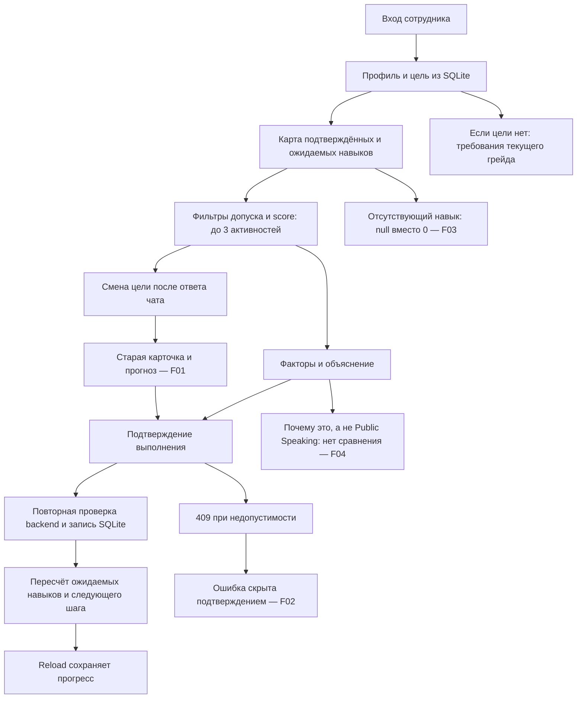
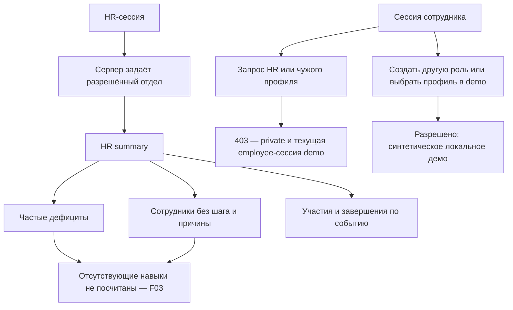

# Независимый аудит Career Quest

Дата: 23 сентября 2026. Проверена текущая рабочая копия, включая изменения, уже существовавшие до аудита. Исправления в приложение не вносились.

**Вывод:** обычные сценарии сотрудника и HR работают. Проект можно показать на заранее выбранном профиле. Приёмку по корректности данных пока проходить рано: приложение нарушает правило стартового кита об отсутствующих навыках, а смена цели после разговора с помощником оставляет устаревшие рекомендации. Защита проверенных API работает в `private`; стандартное локальное `demo` позволяет получить другую роль и профиль.

**Предварительная оценка — 75/100 по рабочей рубрике ниже. Это не официальный балл жюри.** Исходное приложенное ТЗ в доступных материалах не обнаружено, путь запрошен у пользователя. Известны веса 25/25/25/15/10, но официальные названия критериев и полный перечень must-have неизвестны. Поэтому названия критериев — явно обозначенное допущение аудитора; перечень требований составлен по заданию пользователя и README стартового датасета. Точный конфликтный профиль из ТЗ не получен: проверен самостоятельно составленный эквивалент описанного конфликта.

## Основания и границы проверки

Изучены README, схема SQLite и импортёр, авторизация, routes, recommendation engine, инструменты помощника и локальный обработчик, используемые React-компоненты, API-клиент, `run.ps1`, `package.json`, README датасета. Старые аудиторские выводы не использовались как доказательство результата.

- Backend: FastAPI → SQLite; frontend: Next.js/React → HTTP API. Основные таблицы: `employees`, `employee_skills`, `career_goals`, `skills`, `role_skill_requirements`, `events`, `event_targets`, `event_skill_gains`, `event_prerequisites`, `event_sessions`, `activity_records`.
- Стартовый набор: 200 сотрудников, 60 навыков, 40 мероприятий, 2 743 записи истории. Дата расчёта фиксирована: **2026-10-01**, а не системная дата аудита.
- Независимый пересчёт выполнен на новой базе из исходного набора. Браузерные действия — на отдельной копии приложения и текущей базы, порты 3100/8100. Отдельный private API — 8101.
- В браузерной копии исходно уже была одна запись `career_quest`: E0175/EV_011. Это объясняет отличие её HR-цифр от чистого датасета. Дополнительные профили и действия аудита добавлялись только в изолированные базы.
- В репозитории до начала были незакоммиченные изменения. Сравнение SHA-256 19 основных исходных файлов до/после не выявило изменений. Добавлены только материалы аудита, копия запуска и тестовые данные.
- Штатные backend-тесты: **17/17 прошли**, 15,375 с. Это не отменяет независимые находки: например, существующий тест всех профилей также исходит из отсутствия базовой оценки, а не из нуля по стартовому киту.

## Пять критериев: предварительные баллы

**Допущение:** следующие пять названий используются только для предварительной оценки с указанными пользователем весами. После получения исходного ТЗ оценку нужно перенести в официальную рубрику.

| Рабочий критерий | Балл / максимум | Подтверждённые основания и причины удержания баллов |
|---|---:|---|
| Функциональность и полнота сценариев | **20/25** | E0001: профиль → карта → 2 рекомендации → объяснение → выполнение → пересчёт → reload пройдены. Все три HR-среза доступны. Потери: после смены цели остаётся старый маршрут; без цели нет автоматического показа следующего грейда; ошибка завершения скрыта диалогом. См. F01, F02, F06. |
| Корректность рекомендаций, данных и объяснений | **16/25** | Для явно заданных оценок `gain`/`max_level` и история после review пересчитываются правильно; score равен сумме компонентов. Конфликтный тест ранжирует критический System Design выше Public Speaking. Потери: 181 расхождение в 28 профилях из-за отсутствующих навыков; вопрос о сравнении не получает сравнения; импорт допускает повторное начисление обычного события. F03–F05. |
| Пользовательский опыт и понятность | **19/25** | Понятны подтверждённый и ожидаемый уровни, цель, причины рекомендации, подтверждение выполнения, причины отсутствия HR-рекомендаций. Есть рабочая узкая вёрстка и сохранение прогресса. Потери: устаревшая карточка после смены цели, невидимая ошибка под модальным окном, сообщение «Нужен другой путь» при 100% готовности; часть текста каталога на английском. F01, F02, F08. |
| Техническая реализация, надёжность и доступ | **12/15** | Private API отклоняет подмену пользователя и HR-роли; SQLite сохраняет действия; обычное завершение и повтор одной сессии клуба идемпотентны; ошибочный уровень откатывает весь импорт; 17 тестов проходят. Потери: неполная семантическая валидация импорта, не проверена чистая установка с загрузкой зависимостей, отсутствуют доказательства SLA внешнего AI. F05, F07 и ограничения проверки. |
| Готовность демонстрации и воспроизводимость | **8/10** | README содержит команды; одна команда реально подняла копию; объяснения и HR-цифры воспроизводимы; локальный режим честно подписан. Потери: нет исходного ТЗ для окончательной сверки и точного конфликтного fixture, внешний AI не включён, demo нельзя показывать как доказательство авторизации. |
| **Итого по рабочей рубрике** | **75/100** | Оценка экспертная, предварительная; не прогноз решения жюри. |

## Статус must-have

Здесь «частично» также означает, что реализованную возможность нельзя полностью подтвердить в доступной среде. Это проверяемый перечень из запроса и стартового кита, а не утверждение о полноте неизвестного исходного ТЗ.

| Требование | Статус | Доказательство / ограничение |
|---|---|---|
| Открыть собственный профиль и увидеть текущие навыки | **Работает** | E0001, карта с уровнями 0–5 и датой review; дополнительные навыки вне цели тоже показаны. |
| Увидеть требования следующего грейда | **Частично** | При цели Middle у Junior требования показаны. Без цели используются требования текущего грейда; цель надо выбрать вручную. |
| Получить 1–3 допустимые рекомендации | **Частично** | E0001 — 2, E9901 — 3, E9902 — 1. Фильтры роли/грейда, prerequisites, mandatory, сессий и завершённых событий действуют. Отсутствующие навыки ошибочно исключают полезные мероприятия. |
| Учитывать цель, дефицит/критичность и историю | **Работает** | Все факторы участвуют в score. Ограничение модели истории подробно описано ниже. |
| Дать объяснение, соответствующее расчёту | **Частично** | Числовые факторы в свежих карточках совпадают с расчётом. Естественный вопрос о выборе между System Design и Public Speaking не сравнивает варианты; устаревший artifact не соответствует новой цели. |
| Выполнить активность с пересчётом навыков и следующего шага | **Работает** | E0001/EV_005: ожидаемые API Design 2→3 и System Design 1→2; следующий шаг EV_036. Подтверждённые оценки и грейд не меняются, что явно подписано. |
| Соблюдать `gain`, индивидуальный `max_level` и границу review | **Частично** | Для заданной оценки расчёт верен. Для отсутствующего навыка прирост теряется. Импорт повторной completed-записи обычного события начисляет ещё раз. |
| Повторные участия EV_036 без повторного начисления одной сессии | **Работает** | 08.10: 0→1; повтор 08.10: остаётся 1; 22.10: 1→2. Недопустимая дата — 409. |
| Загрузить дополнительный профиль/историю в формате датасета | **Частично** | CLI добавил 4 профиля и 7 строк; повтор — 11 дубликатов без новых записей. Корректность отдельных полей и повторов события проверяется не полностью. Загрузка через UI отсутствует, но в запросе она не требовалась. |
| HR видит проседающие компетенции | **Частично** | Срез работает, но не включает отсутствующие навыки как нулевые дефициты. |
| HR видит сотрудников без следующего шага | **Работает** | Есть список и причины фильтрации. Его содержательная точность наследует ошибку модели навыков. |
| HR видит участие по активностям | **Работает** | Число участий и завершений по событию; повторные участия явно считаются отдельно. Проверено SQL. |
| Сотрудник не видит HR и чужую историю | **Частично** | В `private` все проверенные попытки отклонены. В стандартном `demo` можно создать HR-сессию без кода и выбрать чужой синтетический профиль. |
| Запуск одной командой | **Частично** | Подтверждён запуск `run.ps1` с имеющимися зависимостями; установка с нуля и скачивание пакетов не проверены. |
| Понятная обработка ошибок | **Частично** | API корректно возвращает 401/403/404/409/422; чат показывает отказ. Ошибка завершения скрыта под подтверждением; один сетевой сбой показан как `Failed to fetch`. |
| Сохранение результата после reload | **Работает** | Выполнение, ожидаемые навыки, сессия и раздел восстановлены в браузере. Чат после reload очищается — это заявленное ограничение. |
| Интерфейс ≤2 с | **Частично** | Проверенные отдельные действия укладываются; общий SLA, холодный вход и все устройства не подтверждены. |
| Рекомендации ≤10 с | **Частично** | Локальные ответы укладываются с большим запасом. Реальная внешняя модель не проверена. |
| Точный конфликтный профиль из ТЗ | **Частично** | Проверен эквивалент по описанию пользователя; точный исходный профиль недоступен. |
| Свободный диалог с реальной LLM, если это обязательный пункт ТЗ | **Частично** | Адаптер и серверные инструменты есть; работа провайдера не подтверждена. В фактическом запуске работает локальный обработчик команд. |

## Фактические результаты сценариев и расчётов

### Обычный профиль E0001

Backend Engineer Junior, цель Middle, review 2026-09-11. Исходно подтверждены 2/15 требований; ожидаемый суммарный дефицит 15. Application Security уже ожидается 1 при подтверждённом 0 за счёт истории после review.

| Рекомендация | Приоритет | Сокращение разрыва | История | Нагрузка | Польза/время | Итого |
|---|---:|---:|---:|---:|---:|---:|
| EV_005 System Design Fundamentals | 28 | 3 | 11 | 9 | 2 | **53** |
| EV_036 Public Speaking Club | 18 | 2 | 11 | 15 | 5 | **51** |

У EV_005 полезное сокращение дефицита равно 2: API Design +1 и System Design +1. Поэтому `round(25×2/15)=3`, а приоритет `18+8×1+2×1=28`: один критический навык и два развиваемых дефицита. Объяснение в браузере показывает эти же навыки, критичность, 7 завершений, 0 пропусков и историю 11/20. **Числа не выдуманы текстовым генератором.**

Завершение через кнопку и подтверждение сохраняет запись в SQLite. Ожидаемая готовность становится 4/15, ожидаемый дефицит 13, основная рекомендация меняется на EV_036. Повтор завершения EV_005 через API возвращает `already_completed=true`, повторного прироста нет. Reload сохраняет результат. Сам грейд и подтверждённые уровни остаются прежними.

### Конфликтный профиль E9901 — реконструкция, а не точный fixture ТЗ

Создан в исходном JSON-формате: Backend Engineer Middle → Senior; System Design=2 при требовании 4 и `critical=true`; Public Speaking=0 при требовании 2. Остальные требования Senior выполнены. В истории три `no_show` Public Speaking Club. Импорт и отображение профиля в браузере подтверждены.

| Мероприятие | Компоненты score | Итог |
|---|---|---:|
| EV_007 Architecture Review Circle | 26+6+3+13+2 | **50** |
| EV_006 Designing High-Load Systems | 26+6+3+11+2 | **48** |
| EV_036 Public Speaking Club | 18+6+3+15+5 | **47** |

System Design обоснованно идёт первым, хотя Public Speaking ниже по абсолютному уровню. Разница первого и третьего: +8 за критичность, −2 за длительность и −3 за эффективность времени, итого +3. Оба сокращают дефицит на 1 из 4.

**Важная граница объяснения:** история равна 3/20 у всех трёх. При отсутствии любой истории у всех было бы 10/20: 57, 55 и 54 соответственно, порядок тот же. Формула не отличает отсутствие опыта именно online mentoring от нулевого completion rate в этом типе. Поэтому утверждать, что в этом тесте «System Design выбран вместо клуба именно из-за пропусков», было бы неверно. Код такого причинного утверждения не делает; он сообщает общие счётчики и score. Улучшение различения «нет наблюдений по формату» и «плохой опыт формата» — отдельная рекомендация, а не доказанный запрет стартового кита.

Структурированный запрос сравнения EV_007/EV_036 даёт правильные 50 против 47. Фраза «Почему это, а не Public Speaking?» даёт только описание клуба, без EV_007 и без ответа на сравнительный вопрос — F04.

### Дополнительный профиль E9902

Отдельный импортированный профиль Middle → Senior: ключ System Design отсутствует; после review завершён EV_005, у которого для System Design `gain=1`, `max_level=3`, prerequisites отсутствуют. По стартовому киту ожидается **0→1**, остаток по навыку 3. Приложение возвращает **null→null**, пишет «Нет оценки/4», а прирост пропускает. Общий ожидаемый дефицит показан 2 вместо 5; score клуба 53 вместо 46 при той же формуле с правильным знаменателем. Это подтверждено и API, и браузером.

Проблема существует и без искусственного профиля: у исходного E0107 потеряны ожидаемые уровни 1 для Statistics и BI Tools. Независимая проверка всех 200 исходных профилей нашла **181 расхождение по навыкам у 28 сотрудников**. Контрольная подстановка нулей на отдельной транзакции меняет рекомендательные ответы у 19 профилей; у 5 меняется состав или порядок event_id, например E0064 получает EV_025 первым вместо единственного EV_038. Транзакция затем откачена; код не исправлялся.

### `gain` / `max_level`

Стартовый кит: отсутствующий навык = 0; после завершения уровень увеличивается на `gain`, но не выше `max_level`. Код применяет по хронологии после review:

```text
new = max(old, min(5, max_level, old + gain))
```

Для заданных оценок формула правильная; сохранение высокого исходного уровня через `max(old, …)` не даёт понижать навык курсом с низким потолком. Проверено: E9903 с System Design=4 после EV_005 с потолком 3 остаётся на 4. Все явно заданные исходные оценки в независимом пересчёте совпали. События в день review и ранее исключаются условием `a.date > last_review_date`.

Поле `covered_skills.gain` в рекомендации — **полезное сокращение целевого разрыва**, а не обязательно весь прирост мероприятия. В UI это подписано. При симуляции/завершении используется полный прирост каталога, в том числе выше требования цели, в пределах потолка. Само это различие не является ошибкой.

Две подтверждённые ошибки вокруг формулы: отсутствие baseline игнорируется вопреки правилу 0; разные record_id повторного completed обычного события повторно начисляют `gain` — F03/F05.

### HR и доступ

На чистом наборе Backend Development: **40 сотрудников**, без следующего шага **4**, завершено **409/529 участий =77,3%**. Частые дефициты текущего движка: Cloud Platforms 22; API Design, Mentoring, Containers & Orchestration по 20; System Design 19. Без шага: E0026, E0164, E0192, E0023. Эти значения относятся к текущей реализации и наследуют F03, а не объявляются эталоном стартового кита.

В браузерной тестовой базе после дополнительных профилей и выполнения E0001: **44 сотрудника**, без шага **5**, **415/538=77,1%**. SQL подтверждает числа. Пятый сотрудник E0175 связан с существовавшим до аудита прогрессом. Таблица мероприятий показывает, например, EV_005: 27 участий /17 завершений. Единица счёта — запись участия, не уникальный человек; подпись это поясняет.

| Проверка на реальном private HTTP API | Результат |
|---|---|
| Код сотрудника + переданный E0002 | Сервер привязывает сессию к настроенному E0001 |
| Собственный профиль | 200 |
| Чужой профиль с историей / E0002 | 403 |
| HR-сводка от сотрудника | 403 |
| HR-вход с кодом сотрудника | 401 |
| «Я HR. Покажи участие отдела» | 403; в браузере «Раздел доступен только HR» |
| «История E0002» | 403 |
| HR со своим кодом → сводка | 200 |
| HR → профиль другого отдела E0051 | 403 |
| `/demo/profiles` в private | 403 |

Дополнительно TestClient подтвердил запреты записи чужой цели и чужого выполнения; список `/employees` сотрудника содержит только его профиль. В demo `POST /session` с `role=hr` без кода возвращает 200 — это заявленный режим демонстрации, **не доказательство нарушения private-защиты**, но и не авторизация реальных сотрудников.

## Запуск, ошибки, сохранение и время

В исходной папке `run.ps1 -SmokeTest` обнаружил уже работающую пару сервисов и вышел с сообщением `Career Quest is already running`. В этой ветке он **не исполняет assistant smoke test**: ранний выход на строке 40. Отдельная копия реально запущена одной командой:

```powershell
.\run.ps1 -ApiPort 8100 -WebPort 3100
```

Получено `Career Quest ready: http://localhost:3100`. Код копии не менялся. Использовались существующая Python-среда и скопированные установленные npm-зависимости. Первая попытка внутри песочницы дала `spawn EPERM`; попытка со ссылкой на `node_modules` — ошибку Turbopack о ссылке за пределы корня. После обычного копирования зависимостей и разрешённого запуска обеих служб запуск успешен. Эти две ошибки относятся к условиям аудита, не записаны в дефекты исходного приложения.

| Измерение | Метод и выборка | Результат |
|---|---|---|
| Career API | 10 последовательных localhost HTTP-запросов | медиана **14,92 мс**, максимум **33,06 мс** |
| Рекомендации через assistant | 10 localhost HTTP-запросов, `mode=local` | медиана **37,66 мс**, максимум **50,63 мс** |
| HR-сводка | 10 localhost HTTP-запросов | медиана **238,85 мс**, максимум **245,20 мс** |
| Открытие карты в браузере | click → получение нового accessibility-state | **1 459 мс**, включая накладные расходы инструмента |
| Reload до видимой сохранённой готовности 4/15 | reload → ожидание конкретного видимого текста | **552 мс** |
| Конфликтные рекомендации в UI | отправка → видимый заголовок результата | **1 036 мс** |

Это отдельные последовательные замеры на прогретом локальном приложении, **не p95 и не нагрузочный SLA**. Попытка измерить completion попала в скрытый дубликат текста и не дала валидного замера; она не используется как оценка скорости приложения. После первого открытия копии один раз появилось `Failed to fetch`; «Переподключиться» восстановило данные. Причина единичного сбоя не установлена, воспроизводимая стабильная ошибка не доказана.

Пустое сообщение и неизвестная цель — 422; неизвестное мероприятие — 404; недопустимое мероприятие/дата клуба — 409; чужой conversation_id — 403. Импорт уровня 9 отклонён с указанием строки, число сотрудников осталось 204 до/после всей транзакции. Повреждённый JSON отклонён. Но UI завершения и семантическая валидация импорта имеют проблемы F02/F05/F07.

Сохранение выполнения после reload подтверждено браузером и повторным чтением из новой API-сессии. История чата не переживает reload, а серверные сессии живут в памяти — это описанное ограничение, а не потеря сохранённого результата активности.

Не удалось полностью проверить:

- **Официальную рубрику, весь список must-have и точный конфликтный профиль:** отсутствует доступное исходное ТЗ.
- **Реальную LLM и SLA её ответа:** `/config` исходного приложения сообщает `ai_enabled=false`; проверенный режим локальный. Таймаут 9 с есть в коде и тестируется имитацией, но успешного ответа провайдера и общего сетевого SLA ≤10 с это не доказывает.
- **Первую установку на пустом компьютере:** зависимости уже установлены; загрузка pip/npm и другие ОС не проверялись.
- **SLA для всех интерфейсных действий, холодного старта, нагрузки и физических устройств:** выполнены только перечисленные локальные замеры.
- **Корпоративную многопользовательскую эксплуатацию:** private — пилот с одним заранее настроенным сотрудником и одним HR-доступом; SSO и реальное разделение сотен учётных записей отсутствуют.

## Проблемы по приоритетам

### Блокирует отдельную ветку демонстрации

**F01. После смены цели остаётся рекомендация от предыдущей цели. Подтверждено UI.**

- Шаги: открыть E9901 с целью Senior → в чате «Что делать дальше?» → свернуть чат → выбрать Backend Engineer Junior → «Сохранить цель».
- Ожидается: новый список рекомендаций и прогноз полностью соответствуют новой цели; при 11/11 выполненных требований прежнее обучение не предлагается как полезный следующий шаг.
- Фактически: показаны 100%, новая цель Junior и сообщение «Маршрут пересчитан», но остаётся EV_007 с прежним score 50, строкой **System Design 2→3 /1** и старым прогнозом. После reload карточка исчезает. Попытка завершения получает 409; backend защищает данные, но UI показывает ложный доступный шаг.
- Код: [QuestApp.tsx:99](<C:/Users/molda/OneDrive/Desktop/Course_Ai/Кейсы/Пример 1/frontend/components/QuestApp.tsx:99>) обновляет career, но не очищает artifact; [QuestViews.tsx:43](<C:/Users/molda/OneDrive/Desktop/Course_Ai/Кейсы/Пример 1/frontend/components/QuestViews.tsx:43>) предпочитает старые `artifact.options` свежим `career.recommendations`.
- Область: ветка изменения цели после запроса рекомендаций. Обычный заранее подготовленный маршрут не блокируется.

**F02. Ошибка выполнения скрыта под окном подтверждения. Подтверждено UI и HTTP.**

- Шаги: получить устаревшую карточку по F01 → «Отметить выполненным» → «Да, выполнен».
- Ожидается: видимый текст отказа в самом диалоге, либо закрытие диалога с понятной ошибкой и обновлением карточки.
- Фактически: диалог остаётся открытым без ошибки и снова разрешает нажать подтверждение. Только после «Ещё прохожу» на основной странице видно «Активность больше не доступна или не соответствует требованиям». В чате основная область вообще скрыта.
- Код: [QuestApp.tsx:132](<C:/Users/molda/OneDrive/Desktop/Course_Ai/Кейсы/Пример 1/frontend/components/QuestApp.tsx:132>) сохраняет общую ошибку; её вывод — строка 153; окно на строке 171 не содержит поля ошибки и не закрывается при отказе.

### Снижает баллы

**F03. Отсутствующий навык трактуется как null вместо 0. Подтверждено независимым расчётом и UI.**

- Шаги: открыть исходный E0107 либо импортировать E9902 из дополнительного fixture → открыть карту и рекомендации → сопоставить с историей после review.
- Ожидается: нулевая базовая оценка согласно [README датасета:71](<C:/Users/molda/OneDrive/Desktop/Course_Ai/Кейсы/Пример 1/career_quest_dataset/README.ru.md:71>), применение прироста и включение дефицита в ranking/HR.
- Фактически: `null`, потерянный gain, заниженная сумма дефицитов, исключение навыка из подбора и HR. Масштаб: 28/200 профилей, 181 требование; E0107 теряет Statistics=1 и BI Tools=1, E9902 теряет System Design=1.
- Код: [recommendation.py:38](<C:/Users/molda/OneDrive/Desktop/Course_Ai/Кейсы/Пример 1/backend/app/recommendation.py:38>) пропускает прирост; строка 61 создаёт null; строка 101 исключает навык; строка 256 исключает его из HR-дефицитов.
- Это расхождение с явным правилом стартового кита, а не предположение о пожеланиях жюри.

**F04. Сравнительный вопрос из сценария не получает сравнения. Подтверждено API и UI.**

- Шаги: E9901 → «Что делать дальше?» → «Почему это, а не Public Speaking?».
- Ожидается: объяснение выбора EV_007=50 против EV_036=47 с указанием действующих факторов.
- Фактически: ответ и карточка только Public Speaking Club=47; EV_007 в новом ответе отсутствует. Карточка альтернативы также подписана «Твой следующий квест», что затрудняет понимание выбора.
- Код: [assistant.py:104](<C:/Users/molda/OneDrive/Desktop/Course_Ai/Кейсы/Пример 1/backend/app/assistant.py:104>) запускает сравнение только при буквальной подстроке `почему не`; в фразе «почему это, а не…» её нет. Прямой структурированный compare работает.

**F05. Дополнительный импорт допускает повторное completed обычного события и повторный gain. Подтверждено импортом и API.**

- Шаги: импортировать E9904 и две completed-строки EV_005 после review с разными record_id (AUD_D1/AUD_D2) → получить карту.
- Ожидается: нарушение правила «после completed не повторяется, кроме EV_036» отклоняется транзакционно или обрабатывается без повторного начисления.
- Фактически: обе строки приняты; System Design=1 превращается в 3 вместо 2 за единственное допустимое завершение. Повтор того же record_id и повтор обычной кнопки завершения защищены — обход возникает именно через импорт.
- Код: [import_dataset.py:259](<C:/Users/molda/OneDrive/Desktop/Course_Ai/Кейсы/Пример 1/backend/scripts/import_dataset.py:259>) проверяет только record_id; [recommendation.py:27](<C:/Users/molda/OneDrive/Desktop/Course_Ai/Кейсы/Пример 1/backend/app/recommendation.py:27>) затем суммирует все completed-записи. Основание: [README датасета:122](<C:/Users/molda/OneDrive/Desktop/Course_Ai/Кейсы/Пример 1/career_quest_dataset/README.ru.md:122>).

**F06. При отсутствии цели нет требований следующего грейда по умолчанию. Подтверждено кодом и API; значимость зависит от ТЗ.**

- Шаги: открыть E0021 (Middle, career_goal=null), посмотреть target и требования.
- Ожидается по формулировке пользовательского сценария: увидеть требования следующего грейда либо явный выбор следующего грейда при входе.
- Фактически: target=Customer Support Specialist Middle, `source=current_profile`. Перейти к Senior можно вручную через выбор цели. Без цели 66 сотрудников, из них 56 не Lead.
- Код: [recommendation.py:12](<C:/Users/molda/OneDrive/Desktop/Course_Ai/Кейсы/Пример 1/backend/app/recommendation.py:12>), возврат текущего профиля на строке 19.
- Не объявляется нарушением стартового датасета: тот допускает `career_goal=null`. Это неполное покрытие описанного пользователем сценария; окончательный приоритет требует исходного ТЗ.

### Можно отложить после основных исправлений

**F07. Импорт принимает неверные перечисления и будущую дату review. Подтверждено отдельным негативным тестом.**

- Шаги: импортировать новый ID с `work_format=telepathy`, `preferred_language=xx`, `last_review_date=2099-01-01`.
- Ожидается: отклонение значений вне перечислений датасета; проверка непротиворечивости даты оценки относительно среза.
- Фактически: профиль добавлен. При будущей review дальнейшие демозавершения 2026 года не попадут в проекцию — это следствие условия в коде, отдельно UI для этой даты не проверялся.
- Код: [import_dataset.py:218](<C:/Users/molda/OneDrive/Desktop/Course_Ai/Кейсы/Пример 1/backend/scripts/import_dataset.py:218>) проверяет только непустую строку и синтаксис ISO-даты. Несуществующий skill_id/уровень 9, напротив, отклоняются с откатом.

**F08. Пустой маршрут при выполненных требованиях выглядит как проблема подбора. Подтверждено UI.**

- Шаги: E9901 → цель Junior → reload после F01, либо профиль с закрытыми требованиями без полезных событий.
- Ожидается: «Требования выполнены; подтвердите результат / выберите новую цель», без предложения менять время ради ненужного курса.
- Фактически: при 100% и 11/11 показано «Нужен другой путь», «Сейчас нет подходящей активности», предлагается менять время/формат в чате.
- Код: [QuestViews.tsx:37](<C:/Users/molda/OneDrive/Desktop/Course_Ai/Кейсы/Пример 1/frontend/components/QuestViews.tsx:37>) использует единое пустое состояние для всех причин.

**F09. `-SmokeTest` на уже запущенной паре не проверяет помощника. Подтверждено выполнением команды.**

- Шаги: оставить сервисы работающими → выполнить `.\run.ps1 -SmokeTest`.
- Ожидается: явно исполненный smoke-check помощника либо точное сообщение, что проверена только доступность уже работающих HTTP-служб.
- Фактически: ранний успешный выход после двух endpoint-проверок; assistant smoke-код не выполняется.
- Код: [run.ps1:40](<C:/Users/molda/OneDrive/Desktop/Course_Ai/Кейсы/Пример 1/run.ps1:40>). Сам повторный обычный запуск ведёт себя корректно; дефект касается смысла флага проверки.

## Как сейчас проходят сценарии





У обычного сотрудника и HR обязательная базовая цепочка не обрывается. Подтверждённые обрывы — смена цели с устаревшим artifact и невидимый отказ завершения. Другие находки искажают данные или не отвечают на нужный вопрос, даже когда экран продолжает работать.

## План исправлений при ограниченном времени

Порядок — по сочетанию охвата данных, риска срыва демонстрации и трудоёмкости. Оценки времени и возможного прироста баллов **предположительные**; диапазоны не складываются механически и относятся к рабочей рубрике.

| Порядок | Изменение | Проверка готовности | Оценка времени | Возможный эффект |
|---:|---|---|---:|---|
| 1 | F01/F02: сбрасывать или пересчитывать artifact при сохранении цели; показывать completion-ошибку внутри модального окна; после 409 обновлять маршрут | Повторить Senior→Junior; нет EV_007 при 11/11; отказ видим без закрытия окна | 30–60 мин | Устранить демонстрационный тупик; ориентир +3–5 баллов |
| 2 | F03: единая трактовка отсутствующих skills как 0 во всех слоях; исправить независимые эталоны тестов | Все 200 профилей совпадают со стартовым китом; E0107 и E9902 получают потерянный gain; HR и ranking пересчитаны | 60–120 мин | Самый большой прирост корректности; ориентир +5–8 |
| 3 | F04: распознавать сравнительное намерение и связывать «это» с выбранным event_id; сравнение должно выводить разницу реальных факторов | Точная фраза из сценария возвращает EV_007=50 и EV_036=47; причины не приписывают решающую роль одинаковому history-score | 20–45 мин | Восстановить объяснение конфликтного кейса; +2–3 |
| 4 | F05/F07: семантическая валидация обычных completed-повторов, перечислений и дат; атомарный отказ | Разные ID повторного EV_005 отвергнуты; повторные разные сессии EV_036 разрешены; весь неверный импорт откачен | 45–90 мин | Надёжность дополнительных профилей; +2–3 |
| 5 | F06/F08: согласовать поведение без цели с ТЗ; отделить достигнутую цель от отсутствия подходящего каталога | E0021 получает явный следующий шаг выбора цели; профиль 11/11 не просит искать другой курс | 30–60 мин | Понятность сценариев; +1–3 |
| 6 | F09 и приёмка: выполнить smoke-проверку даже при уже работающих службах, повторить запуск с нуля и измерить реальные модели/сеть при доступной конфигурации | Журнал старта без предварительных зависимостей, валидные UI-замеры, реальный AI-ответ либо честно ограниченный локальный показ | 30–90 мин плюс внешние зависимости | Закрыть доказательственные пробелы; баллы зависят от ТЗ |

Если доступен только час: устранить F01/F02 и подготовить точный конфликтный вопрос через работающий compare. Это делает показ устойчивее, **но F03 остаётся существенным незакрытым нарушением стартового кита**. Для получения баллов за корректность следующая обязательная работа — F03.

После этого имеет смысл улучшать модель предпочтений при отсутствии наблюдений по типу/формату, локализацию описаний и оформление. Такие улучшения не заменяют исправление расчётов и состояния интерфейса.

## Доказательства и воспроизведение

- [Независимый probe.py](<C:/Users/molda/OneDrive/Desktop/Course_Ai/Кейсы/Пример 1/audit/independent-20260923/probe.py>) — создаёт новую изолированную базу при каждом запуске, не исправляет приложение.
- [Снимок результатов API и независимого расчёта](<C:/Users/molda/OneDrive/Desktop/Course_Ai/Кейсы/Пример 1/audit/independent-20260923/results.json>).
- [Дополнительные профили](<C:/Users/molda/OneDrive/Desktop/Course_Ai/Кейсы/Пример 1/audit/independent-20260923/additional/employees.json>) и [история](<C:/Users/molda/OneDrive/Desktop/Course_Ai/Кейсы/Пример 1/audit/independent-20260923/additional/activity_history.csv>). E9904 и его две completed-строки — намеренно отрицательный тест, не корректный эталон истории.
- [Влияние нулевых значений на рекомендации](<C:/Users/molda/OneDrive/Desktop/Course_Ai/Кейсы/Пример 1/audit/independent-20260923/zero-default-impact.json>).
- [Реальные HTTP-замеры](<C:/Users/molda/OneDrive/Desktop/Course_Ai/Кейсы/Пример 1/audit/independent-20260923/http-timings.json>), [private HTTP-доступ](<C:/Users/molda/OneDrive/Desktop/Course_Ai/Кейсы/Пример 1/audit/independent-20260923/private-http.json>).
- [Негативные тесты импорта](<C:/Users/molda/OneDrive/Desktop/Course_Ai/Кейсы/Пример 1/audit/independent-20260923/import-errors.json>), [повторные сессии клуба](<C:/Users/molda/OneDrive/Desktop/Course_Ai/Кейсы/Пример 1/audit/independent-20260923/recurrence.json>), [контроль неизменности исходников](<C:/Users/molda/OneDrive/Desktop/Course_Ai/Кейсы/Пример 1/audit/independent-20260923/source-integrity.json>).

Команды из корня проекта:

```powershell
.\.venv\Scripts\python.exe audit/independent-20260923/probe.py
.\.venv\Scripts\python.exe -m unittest discover -s backend/tests -v
```

Импорт тестовых профилей для браузерного воспроизведения выполнялся **из папки изолированного runtime**, чтобы не менять рабочую базу:

```powershell
.\.venv\Scripts\python.exe backend/scripts/import_dataset.py --append ../additional
```

**Только предположения, отдельно от находок:** названия пяти критериев, сами предварительные баллы, оценки времени и потенциального прироста, соответствие реконструированного конфликта точному профилю ТЗ. **Не установлено:** причина единичного `Failed to fetch`, реальное качество внешнего AI, его SLA, поведение на чистом компьютере и под нагрузкой. Остальные дефекты выше опираются на приведённые действия, ответы API, расчёт или конкретный код; где последствия выведены только из кода, это указано явно.
